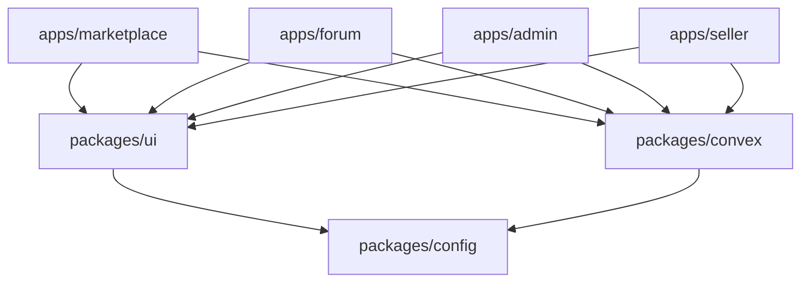

# Createconomy

> A production-ready digital e-commerce marketplace platform connecting creators with consumers.

[](https://opensource.org/licenses/MIT)
[](https://nodejs.org)
[](https://pnpm.io)
[](https://www.typescriptlang.org)

---

## 📋 Table of Contents

- [Overview](#overview)
- [Tech Stack](#tech-stack)
- [Monorepo Structure](#monorepo-structure)
- [Quick Start](#quick-start)
- [Development Setup](#development-setup)
- [Available Scripts](#available-scripts)
- [Environment Variables](#environment-variables)
- [Deployment](#deployment)
- [Documentation](#documentation)
- [Contributing](#contributing)
- [License](#license)

---

## Overview

Createconomy is a comprehensive digital marketplace platform that combines a robust e-commerce storefront with an integrated community forum. The platform enables creators to build audiences while selling their digital products.

### Key Features

- 🛒 **Digital Marketplace** - Browse, purchase, and download digital products
- 💬 **Community Forum** - Engage with creators and other users
- 📊 **Seller Dashboard** - Manage products, orders, and analytics
- 🔐 **Admin Console** - Platform administration and moderation
- ⚡ **Real-time Updates** - Powered by Convex for instant data synchronization
- 🔒 **Secure Payments** - Stripe integration with Connect for marketplace payouts

### Platform Applications

| Application | Domain | Description |
|-------------|--------|-------------|
| **Marketplace** | `createconomy.com` | Main storefront for browsing and purchasing |
| **Forum** | `discuss.createconomy.com` | Community discussion platform |
| **Admin** | `console.createconomy.com` | Administrative interface |
| **Seller** | `seller.createconomy.com` | Vendor dashboard |

---

## Tech Stack

### Frontend
- **Framework**: [Next.js 16](https://nextjs.org) with App Router
- **Language**: [TypeScript 5.9+](https://www.typescriptlang.org)
- **Styling**: [Tailwind CSS 4](https://tailwindcss.com)
- **UI Components**: [Radix UI](https://www.radix-ui.com) primitives
- **State Management**: React Server Components + Convex

### Backend
- **Database & Functions**: [Convex 1.31+](https://convex.dev)
- **Authentication**: [Convex Auth](https://labs.convex.dev/auth) with OAuth providers
- **Payments**: [Stripe](https://stripe.com) with Connect

### Infrastructure
- **Monorepo**: [Turborepo](https://turbo.build)
- **Package Manager**: [pnpm 10+](https://pnpm.io)
- **Deployment**: [Vercel](https://vercel.com)
- **CI/CD**: GitHub Actions

📖 Full details → [docs/tech-stack.md](./docs/tech-stack.md)

---

## Monorepo Structure

```
createconomy/
├── apps/
│   ├── marketplace/          # Main storefront (createconomy.com)
│   ├── forum/                # Community forum (discuss.createconomy.com)
│   ├── admin/                # Admin dashboard (console.createconomy.com)
│   └── seller/               # Seller portal (seller.createconomy.com)
├── packages/
│   ├── ui/                   # Shared UI components & hooks
│   ├── config/               # Shared configuration (ESLint, TypeScript, Tailwind)
│   └── convex/               # Convex backend (schema, functions, auth)
├── docs/                     # Documentation
├── plans/                    # Architecture & planning documents
├── turbo.json                # Turborepo configuration
├── pnpm-workspace.yaml       # pnpm workspace configuration
└── package.json              # Root package.json
```

### Package Dependencies



---

## Quick Start

### Prerequisites

- **Node.js** >= 24.0.0
- **pnpm** >= 10.0.0
- **Convex Account** - [Sign up](https://convex.dev)
- **Stripe Account** - [Sign up](https://stripe.com)

### Installation

```bash
# Clone the repository
git clone https://github.com/your-org/createconomy.git
cd createconomy

# Install dependencies
pnpm install

# Copy environment variables
cp .env.example .env.local

# Set up Convex
cd packages/convex
npx convex dev --once  # Initialize Convex project
cd ../..

# Start development servers
pnpm dev
```

---

## Development Setup

### 1. Install Dependencies

```bash
pnpm install
```

### 2. Configure Environment Variables

Copy the example environment file and fill in your values:

```bash
cp .env.example .env.local
```

See [Environment Variables](#environment-variables) for detailed configuration.

### 3. Set Up Convex

```bash
# Navigate to convex package
cd packages/convex

# Initialize Convex (first time only)
npx convex dev --once

# Start Convex development server
npx convex dev
```

### 4. Set Up Stripe (Optional for Development)

1. Create a Stripe account at [stripe.com](https://stripe.com)
2. Get your API keys from the Stripe Dashboard
3. Set up Stripe Connect for marketplace functionality
4. Configure webhook endpoints

### 5. Start Development

```bash
# Start all applications
pnpm dev

# Or start specific applications
pnpm dev --filter=marketplace
pnpm dev --filter=forum
pnpm dev --filter=admin
pnpm dev --filter=seller
```

### Development URLs

| Application | URL |
|-------------|-----|
| Marketplace | http://localhost:3000 |
| Forum | http://localhost:3001 |
| Admin | http://localhost:3002 |
| Seller | http://localhost:3003 |

---

## Available Scripts

### Root Level

| Script | Description |
|--------|-------------|
| `pnpm dev` | Start all applications in development mode |
| `pnpm build` | Build all applications for production |
| `pnpm lint` | Run ESLint across all packages |
| `pnpm format` | Format code with Prettier |
| `pnpm format:check` | Check code formatting |
| `pnpm typecheck` | Run TypeScript type checking |
| `pnpm test` | Run tests across all packages |
| `pnpm test:coverage` | Run tests with coverage report |
| `pnpm clean` | Clean build artifacts and node_modules |

### Package-Specific

```bash
# Run command for specific package
pnpm --filter=<package-name> <command>

# Examples
pnpm --filter=marketplace dev
pnpm --filter=@createconomy/ui build
pnpm --filter=@createconomy/convex deploy
```

---

## Environment Variables

### Required Variables

| Variable | Description |
|----------|-------------|
| `CONVEX_DEPLOYMENT` | Convex deployment identifier |
| `NEXT_PUBLIC_CONVEX_URL` | Public Convex URL |
| `STRIPE_SECRET_KEY` | Stripe secret API key |
| `NEXT_PUBLIC_STRIPE_PUBLISHABLE_KEY` | Stripe publishable key |
| `STRIPE_WEBHOOK_SECRET` | Stripe webhook signing secret |
| `AUTH_SECRET` | Authentication secret (generate with `openssl rand -base64 32`) |

### Optional Variables

| Variable | Description |
|----------|-------------|
| `STRIPE_CONNECT_CLIENT_ID` | Stripe Connect client ID |
| `TURBO_TOKEN` | Turborepo remote cache token |
| `TURBO_TEAM` | Turborepo team identifier |
| `RESEND_API_KEY` | Email service API key |
| `UPLOADTHING_SECRET` | File upload service secret |

### Application URLs

| Variable | Default |
|----------|---------|
| `NEXT_PUBLIC_MARKETPLACE_URL` | `https://createconomy.com` |
| `NEXT_PUBLIC_FORUM_URL` | `https://discuss.createconomy.com` |
| `NEXT_PUBLIC_ADMIN_URL` | `https://console.createconomy.com` |
| `NEXT_PUBLIC_SELLER_URL` | `https://seller.createconomy.com` |

---

## Deployment

### Vercel Deployment

The platform is designed for deployment on Vercel with multi-project support.

#### 1. Connect Repository

1. Import your repository to Vercel
2. Configure each application as a separate project
3. Set the root directory for each project (e.g., `apps/marketplace`)

#### 2. Configure Build Settings

For each application:

```
Framework Preset: Next.js
Build Command: cd ../.. && pnpm turbo build --filter=<app-name>
Output Directory: .next
Install Command: pnpm install
```

#### 3. Set Environment Variables

Add all required environment variables in the Vercel dashboard for each project.

#### 4. Configure Domains

| Application | Domain |
|-------------|--------|
| Marketplace | `createconomy.com` |
| Forum | `discuss.createconomy.com` |
| Admin | `console.createconomy.com` |
| Seller | `seller.createconomy.com` |

### Convex Deployment

```bash
cd packages/convex
npx convex deploy
```

## Documentation

All detailed documentation lives in the [`docs/`](./docs/) folder:

| Document | Description |
|----------|-------------|
| [Tech Stack](./docs/tech-stack.md) | Complete technology versions and details |
| [Architecture](./docs/architecture.md) | System diagrams, data flow, auth flow, payment flow |
| [Key Files](./docs/key-files.md) | Important file locations and entry points |
| [Data Models](./docs/data-models.md) | Full database schema reference |
| [Conventions](./docs/conventions.md) | Naming, imports, React/Convex patterns, rules |
| [Pitfalls](./docs/pitfalls.md) | Common mistakes and known issues |
| [Commands](./docs/commands.md) | CLI commands reference |
| [Environment](./docs/environment.md) | Environment variables and config files |
| [API Reference](./docs/api-reference.md) | Convex functions, HTTP endpoints, error codes |
| [Security](./docs/security.md) | Auth, CSRF, rate limiting, headers, payment security |
| [Deployment](./docs/deployment.md) | Vercel setup, CI/CD, branch protection |
| [Local Development](./docs/local-development.md) | Setup guide, debugging, IDE config |
| [Contributing](./docs/contributing.md) | Branch naming, commits, PR process, coding standards |
| [Troubleshooting](./docs/troubleshooting.md) | Common issues and solutions |

See also: [AGENTS.md](./AGENTS.md) for AI agent quick reference.

---

## Contributing

We welcome contributions! Please see our [Contributing Guide](./docs/contributing.md) for details.

### Quick Contribution Steps

1. Fork the repository
2. Create a feature branch (`git checkout -b feature/amazing-feature`)
3. Commit your changes (`git commit -m 'feat: add amazing feature'`)
4. Push to the branch (`git push origin feature/amazing-feature`)
5. Open a Pull Request

---

## License

This project is licensed under the MIT License - see the [LICENSE](./LICENSE) file for details.

---

## Support

- 📖 [Documentation](./docs/)
- 🐛 [Issue Tracker](https://github.com/your-org/createconomy/issues)
- 💬 [Discussions](https://github.com/your-org/createconomy/discussions)

---

<p align="center">
  Built with ❤️ by the Createconomy Team
</p>
