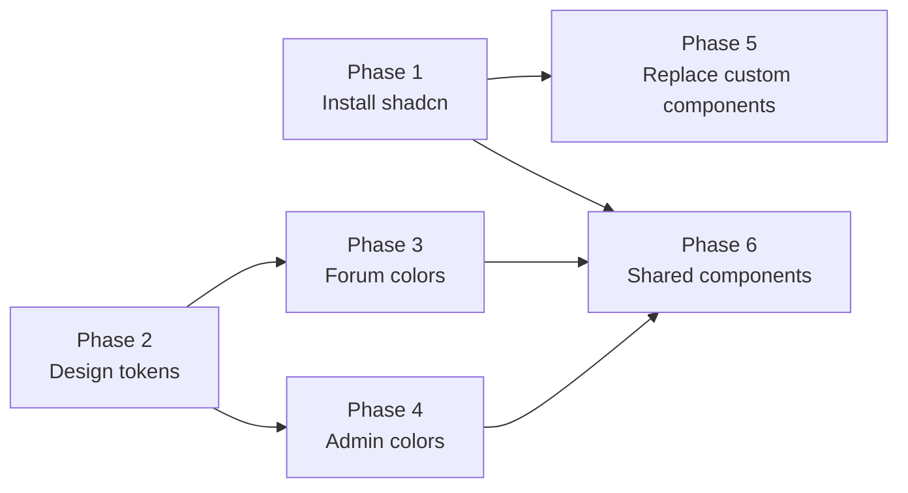

# Color Sweet Spot — Overview

> Consolidate the Createconomy design system from ~19 colors down to 6 intentional design tokens, replace custom components with shadcn equivalents, and standardize icon coloring.

## Current State

- **~13 hardcoded Tailwind named colors** used directly in components (red, orange, blue, green, yellow, purple, pink, amber, cyan, violet, gray, etc.)
- **6 design tokens** properly defined in `packages/ui/src/globals.css` (primary, destructive, success, warning, info, neutrals)
- **12 shadcn components** installed in shared UI package
- **20+ files** using `Loader2` with `animate-spin` instead of a shared Spinner
- **Duplicated notification icon logic** in 2 different files

## Target State

- **6 design token colors** only (primary + success + warning + destructive + neutrals + optional upvote/downvote)
- **25+ shadcn components** covering all common UI patterns
- **1 shared Spinner** component replacing all `Loader2` copies
- **1 shared NotificationIcon** component replacing duplicated logic
- **All icon colors** mapped to design tokens, not Tailwind named colors

## Phases

| Phase | File | Description |
|-------|------|-------------|
| 1 | [phase-01-shadcn-components.md](./phase-01-shadcn-components.md) | Install missing shadcn components into `@createconomy/ui` |
| 2 | [phase-02-design-tokens.md](./phase-02-design-tokens.md) | Add vote tokens, update `globals.css` theme mapping |
| 3 | [phase-03-forum-colors.md](./phase-03-forum-colors.md) | Replace hardcoded colors in forum app components |
| 4 | [phase-04-admin-colors.md](./phase-04-admin-colors.md) | Replace hardcoded colors in admin app components |
| 5 | [phase-05-component-replacements.md](./phase-05-component-replacements.md) | Replace custom components with shadcn equivalents |
| 6 | [phase-06-shared-components.md](./phase-06-shared-components.md) | Create shared NotificationIcon + Spinner components |

## Dependency Order

Phases 1 and 2 can run in parallel. Phases 3 and 4 can run in parallel after Phase 2. Phase 5 depends on Phase 1. Phase 6 depends on Phases 1, 3, and 4.

## Key Files Modified

- `packages/ui/src/globals.css` — Add vote tokens
- `packages/ui/src/index.ts` — Export new components
- `packages/ui/src/components/*.tsx` — New shadcn components
- `apps/forum/src/components/**/*.tsx` — Color token replacements (~15 files)
- `apps/admin/src/app/**/*.tsx` — Color token replacements (~10 files)
- `apps/admin/src/components/**/*.tsx` — Component replacements
