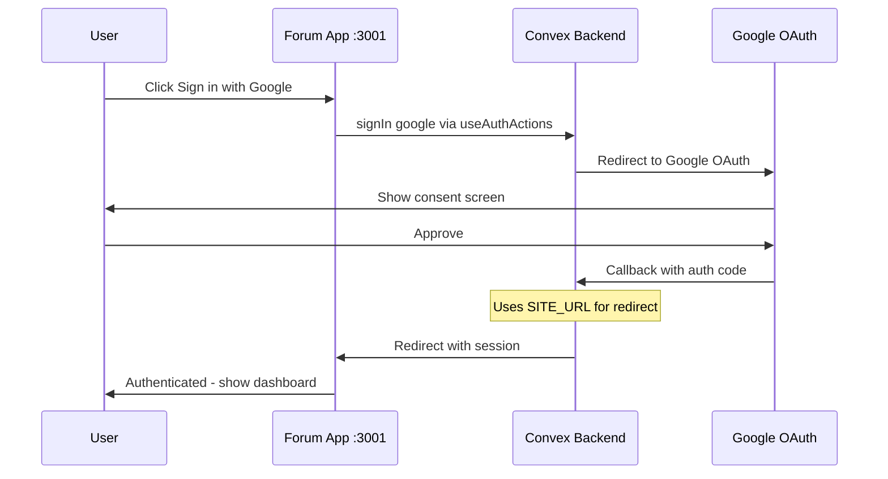

# Fix Forum App: Middleware Migration & Google OAuth

## Overview

This plan addresses two issues with the forum app:
1. **Next.js 16 Middleware Deprecation**: The `middleware.ts` file convention is deprecated and needs to be migrated to `proxy.ts`
2. **Google OAuth Sign-in Failure**: Google sign-in is failing with "Can't continue with google.com. Something went wrong"

---

## Phase 1: Next.js 16 Middleware to Proxy Migration

### Background

In Next.js 16, the `middleware` filename has been deprecated and renamed to `proxy`. The key changes are:

- Rename [`middleware.ts`](apps/forum/src/middleware.ts:1) to `proxy.ts`
- Rename the exported `middleware` function to `proxy`
- The `proxy` runtime uses `nodejs` and does NOT support the `edge` runtime
- Update any config flags (e.g., `skipMiddlewareUrlNormalize` → `skipProxyUrlNormalize`)

### Files to Modify

| File | Action |
|------|--------|
| [`apps/forum/src/middleware.ts`](apps/forum/src/middleware.ts:1) | Rename to `proxy.ts` and update export |
| [`apps/admin/src/middleware.ts`](apps/admin/src/middleware.ts:1) | Rename to `proxy.ts` and update export |

### Migration Steps

1. **Rename file**: `apps/forum/src/middleware.ts` → `apps/forum/src/proxy.ts`
2. **Update export**: Change `export function middleware(request: NextRequest)` to `export function proxy(request: NextRequest)`
3. **Update config export**: Rename `config.matcher` stays the same, the export name `config` is unchanged
4. **Repeat for admin app** if needed

### Code Change Example

```typescript
// Before (middleware.ts)
export function middleware(request: NextRequest) {
  // ... implementation
}

export const config = {
  matcher: [/* ... */],
};

// After (proxy.ts)
export function proxy(request: NextRequest) {
  // ... implementation
}

export const config = {
  matcher: [/* ... */],
};
```

### Note on Edge Runtime

The current middleware uses standard `NextResponse` which is compatible with the nodejs runtime. If `edge` runtime is specifically needed, you can keep using `middleware.ts` until further Next.js guidance is provided.

---

## Phase 2: Fix Google OAuth Sign-in

### Root Cause Analysis

The Google OAuth sign-in error "Can't continue with google.com. Something went wrong" is caused by missing/misconfigured OAuth settings:

1. **Missing `SITE_URL`**: Convex Auth requires `SITE_URL` environment variable for OAuth redirect URLs
2. **Missing OAuth Credentials**: `AUTH_GOOGLE_ID` and `AUTH_GOOGLE_SECRET` may not be set in Convex
3. **Incorrect Redirect URIs**: Google Cloud Console may not have the correct redirect URIs

### Required Environment Variables

#### Convex Backend (set via `npx convex env set`)

| Variable | Value | Purpose |
|----------|-------|---------|
| `SITE_URL` | `http://localhost:3001` | OAuth redirect base URL (development) |
| `AUTH_GOOGLE_ID` | `<Google Client ID>` | Google OAuth Client ID |
| `AUTH_GOOGLE_SECRET` | `<Google Client Secret>` | Google OAuth Client Secret |

#### Forum App (.env.local) - Already Set

| Variable | Current Value |
|----------|---------------|
| `NEXT_PUBLIC_CONVEX_URL` | `https://merry-skunk-642.convex.cloud` |
| `NEXT_PUBLIC_GOOGLE_CLIENT_ID` | `825576887852-3i8gc8o7v7nsslvg5notbinnjg7hk5pm.apps.googleusercontent.com` |

### Configuration Steps

1. **Set SITE_URL in Convex**:
   ```bash
   npx convex env set SITE_URL http://localhost:3001
   ```

2. **Set Google OAuth credentials in Convex** (if not already set):
   ```bash
   npx convex env set AUTH_GOOGLE_ID 825576887852-3i8gc8o7v7nsslvg5notbinnjg7hk5pm.apps.googleusercontent.com
   npx convex env set AUTH_GOOGLE_SECRET <your-google-client-secret>
   ```

3. **Configure Google Cloud Console**:
   - Go to [Google Cloud Console](https://console.cloud.google.com/apis/credentials)
   - Find the OAuth 2.0 Client ID for the forum app
   - Add authorized redirect URIs:
     - Development: `https://merry-skunk-642.convex.site/api/auth/callback/google`
     - The redirect is handled by Convex Auth, not the Next.js app directly

### Google Cloud Console Redirect URI

For Convex Auth with OAuth, the redirect URI follows this pattern:
```
https://<convex-deployment>.convex.site/api/auth/callback/<provider>
```

For this project:
```
https://merry-skunk-642.convex.site/api/auth/callback/google
```

### ⚠️ REQUIRED MANUAL STEP: Add Redirect URI to Google Cloud Console

The OAuth flow is now reaching Google but returning `Error 400: redirect_uri_mismatch`. 

**To fix this:**

1. Go to [Google Cloud Console - Credentials](https://console.cloud.google.com/apis/credentials)
2. Find the OAuth 2.0 Client ID: `825576887852-3i8gc8o7v7nsslvg5notbinnjg7hk5pm.apps.googleusercontent.com`
3. Click to edit the client
4. Under "Authorized redirect URIs", add:
   ```
   https://merry-skunk-642.convex.site/api/auth/callback/google
   ```
5. Save the changes

**Note**: Changes may take a few minutes to propagate.

---

## Phase 3: Verification

### Testing Checklist

1. [ ] Forum app starts without middleware deprecation warnings
2. [ ] Navigation and route protection work correctly with proxy
3. [ ] Google OAuth redirect works (no CORS errors)
4. [ ] Google sign-in completes successfully
5. [ ] User session is created after OAuth callback
6. [ ] User can access authenticated routes after sign-in

### Debug Commands

```bash
# Check Convex environment variables
npx convex env list

# Check Convex function logs
npx convex logs
```

---

## Architecture Diagram



---

## Files Reference

| Component | File Path | Purpose |
|-----------|-----------|---------|
| Forum Middleware | [`apps/forum/src/middleware.ts`](apps/forum/src/middleware.ts) | Route protection, CORS |
| Forum Auth Hook | [`apps/forum/src/hooks/use-auth.ts`](apps/forum/src/hooks/use-auth.ts) | Client-side auth state |
| Forum Sign-in | [`apps/forum/src/components/auth/sign-in-form.tsx`](apps/forum/src/components/auth/sign-in-form.tsx) | Sign-in UI |
| Convex Auth | [`packages/convex/convex/auth.ts`](packages/convex/convex/auth.ts) | OAuth providers config |
| Convex Auth Config | [`packages/convex/convex/auth.config.ts`](packages/convex/convex/auth.config.ts) | Session config |
| Convex HTTP Routes | [`packages/convex/convex/http.ts`](packages/convex/convex/http.ts) | Auth HTTP endpoints |

---

## Summary of Actions

### Immediate Actions (Code Mode Required)

1. Rename `apps/forum/src/middleware.ts` to `apps/forum/src/proxy.ts`
2. Update export function name from `middleware` to `proxy`
3. Set `SITE_URL` environment variable in Convex: `npx convex env set SITE_URL http://localhost:3001`
4. Verify `AUTH_GOOGLE_ID` and `AUTH_GOOGLE_SECRET` are set in Convex

### Manual Actions (User Required)

1. Verify Google Cloud Console has correct redirect URI
2. Obtain Google Client Secret if not available
3. Restart development servers after changes

