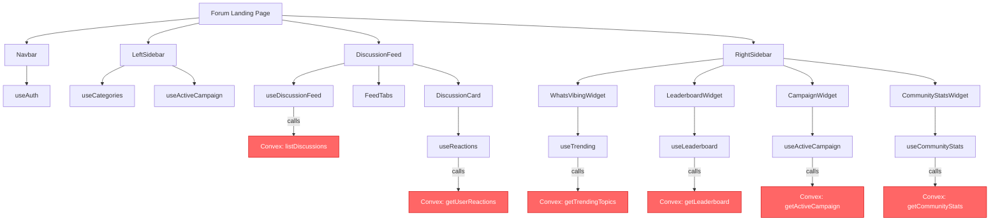

# Fix Forum Landing Page Runtime Crash

## Problem Summary

The forum landing page (`apps/forum/src/app/page.tsx`) crashes at runtime because **five Convex query functions used by the homepage have never been deployed** to the development environment. Every hook on the page attempts to call functions that don't exist on the server, causing Convex to throw errors that bubble up as uncaught exceptions and crash the React render tree.

## Root Cause

The file [`packages/convex/convex/functions/forum.ts`](../../packages/convex/convex/functions/forum.ts:981) defines these query/mutation functions that the homepage needs:

| Function | Line | Used By |
|----------|------|---------|
| `listDiscussions` | 981 | [`useDiscussionFeed`](../../apps/forum/src/hooks/use-discussion-feed.ts:62) |
| `getLeaderboard` | 1082 | [`useLeaderboard`](../../apps/forum/src/hooks/use-leaderboard.ts:17) |
| `getCommunityStats` | 1169 | [`useCommunityStats`](../../apps/forum/src/hooks/use-community-stats.ts:13) |
| `getTrendingTopics` | 1206 | [`useTrending`](../../apps/forum/src/hooks/use-trending.ts:13) |
| `getActiveCampaign` | 1260 | [`useActiveCampaign`](../../apps/forum/src/hooks/use-campaign.ts:13) |
| `toggleReaction` | 1293 | [`useReactions`](../../apps/forum/src/hooks/use-reactions.ts:24) |
| `getUserReactions` | 1415 | [`useReactions`](../../apps/forum/src/hooks/use-reactions.ts:19) |
| `getUserProfile` | 1454 | user profile page |
| `getCategoryBySlug` | 1508 | category page |
| `listThreadsBySlug` | 1543 | category page |
| `getUserThreads` | 1636 | user profile page |

**These functions exist in source code but were never pushed to Convex.** The Convex logs confirm:

```
Could not find public function for 'functions/forum:listDiscussions'.
Did you forget to run `npx convex dev` or `npx convex deploy`?
```

Additionally, the frontend hooks lack defensive error handling — when Convex throws a server-side error, it propagates as an uncaught exception rather than being caught and rendered as an error/empty state.

## Architecture Diagram



Red nodes = functions that are **not deployed** and cause the crash.

## Fix Strategy

1. **Phase 01 — Deploy Convex functions**: Push the current `forum.ts` to the dev environment so all functions exist
2. **Phase 02 — Add defensive error handling**: Wrap all Convex query hooks with proper error boundaries and safe defaults so the page never crashes even if functions fail
3. **Phase 03 — Verify end-to-end**: Confirm landing page loads with zero posts, and that creating a new thread works

## Phase Files

- [Phase 01 — Deploy Convex Functions](./phase-01-deploy.md)
- [Phase 02 — Defensive Error Handling](./phase-02-defensive-hooks.md)
- [Phase 03 — Verification](./phase-03-verify.md)
