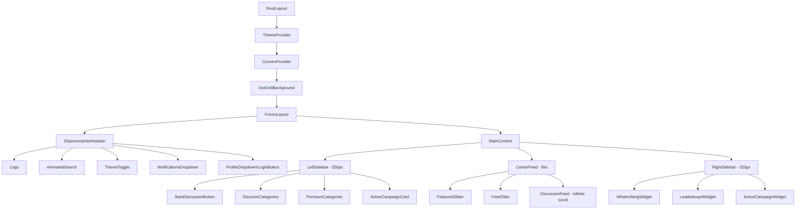

# Forum App Redesign - Premium Design Implementation

## Overview

Complete redesign of the Forum app with a premium, modern aesthetic inspired by Linear, Vercel, and GitHub discussions. The design features glassmorphism effects, subtle glows, and smooth animations.

## Design System

### Color Palette
- **Primary**: Indigo (#6366f1)
- **Background Light**: White with light gray dots
- **Background Dark**: Pure black with dark gray dots
- **Border Radius**: Large (1.3rem / 20px) for modern feel
- **Shadows**: Subtle glows on interactive elements

### Typography
- Font: Inter (already configured)
- Headings: Bold, tracking-tight
- Body: Regular weight

## Component Architecture



## File Structure

```
apps/forum/src/
├── app/
│   ├── layout.tsx              # Root layout with providers
│   ├── page.tsx                # Main forum page (redesigned)
│   └── globals.css             # Updated CSS variables
├── components/
│   ├── layout/
│   │   ├── forum-layout.tsx    # Three-column layout wrapper
│   │   ├── left-sidebar.tsx    # Categories sidebar
│   │   ├── right-sidebar.tsx   # Widgets sidebar
│   │   └── mobile-nav.tsx      # Mobile navigation drawer
│   ├── navbar/
│   │   └── forum-navbar.tsx    # Forum-specific navbar config
│   ├── feed/
│   │   ├── featured-slider.tsx # Carousel component
│   │   ├── feed-tabs.tsx       # Top/Hot/New/Fav tabs
│   │   ├── discussion-card.tsx # Individual post card
│   │   ├── discussion-feed.tsx # Infinite scroll feed
│   │   └── avatar-stack.tsx    # Stacked user avatars
│   ├── widgets/
│   │   ├── whats-vibing.tsx    # Morphing card stack
│   │   ├── leaderboard.tsx     # Weekly top creators
│   │   └── campaign-card.tsx   # Active campaign widget
│   └── ui/
│       ├── glow-button.tsx     # Button with glow effect
│       ├── glow-card.tsx       # Card with hover glow
│       └── category-item.tsx   # Sidebar category item
├── data/
│   └── mock-data.ts            # Mock data for development
├── hooks/
│   ├── use-infinite-scroll.ts  # Infinite scroll hook
│   └── use-feed-filter.ts      # Feed filtering hook
└── types/
    └── forum.ts                # Forum-specific types
```

## Component Specifications

### 1. DotGridBackground (Existing - May need updates)
- Full-page dot grid pattern
- Fade-center mask effect
- Dark mode: darker dots
- Light mode: lighter dots

### 2. GlassmorphismNavbar (Existing - Use as-is)
Components to configure:
- Logo: Circle icon + "Createconomy" text
- AnimatedSearch: Icon → full search bar animation
- ThemeToggle: Sun/moon with rotation animation
- NotificationsDropdown: Bell with badge + dropdown
- ProfileDropdown/LoginButton: Avatar dropdown or login

Style:
- Height: 64px
- Padding: px-6
- Glass effect: backdrop-blur-md
- Border bottom: subtle gradient

### 3. FeaturedSlider (New)
- Horizontal carousel with 4 featured posts
- Auto-play with smooth transitions
- Navigation arrows + dot indicators
- Height: 280px
- Card hover: scale 1.05x

### 4. FeedTabs (New)
- Tabs: Top 🔥 | Hot 🔥 | New 🆕 | Fav ⭐
- Pills style with rounded edges
- Active: Primary color + glow
- Smooth underline animation

### 5. LeftSidebar (New)
Structure:
- Start Discussion button (primary, full width, glow)
- DISCOVER section: News, Review, Compare, List, Help, Showcase, Tutorial
- PREMIUM section: Debate, Launch (with points required)
- Active Campaign card (bottom)

Style:
- Width: 250px
- Category: Icon + Label + Count
- Hover: Background + left border accent

### 6. DiscussionCard (New)
Layout:
```
┌──────────────────────────────────────────┐
│ ● Avatar | Username | @handle | 2h ago   │
│                                          │
│ Title of Discussion (20px, bold)         │
│ AI one-liner summary (14px, muted)       │
│                                          │
│ [Optional: Preview image]                │
│                                          │
│ ↑342  💬89  👥[avatars]  ⭐  ⋮           │
└──────────────────────────────────────────┘
```

Features:
- Border with hover glow
- Lift effect on hover (translateY -2px)
- Category badge (colored pill)
- Avatar stack (max 5, +N)
- Upvote bounce animation

### 7. RightSidebar Widgets (New)

**WhatsVibingWidget:**
- Morphing card stack (3 trending topics)
- Auto-rotate every 4 seconds
- Height: 200px

**LeaderboardWidget:**
- Title: "🏆 Weekly Top Creators"
- Top 3 with rank badges
- Mini trend chart
- "View Full Leaderboard" link

**ActiveCampaignWidget:**
- Gradient background
- Prize details + countdown
- "Enter Now" button (glowing)
- Progress bar

### 8. InfiniteScroll (New)
- Load more on scroll
- Shimmer skeleton loading
- Smooth fade-in for new cards

## Animations (Framer Motion)

| Element | Animation | Duration |
|---------|-----------|----------|
| Page load | Stagger fade-in | 50ms delay each |
| Hover states | Smooth transitions | 200ms |
| Upvote click | Bounce (scale 1.2 → 1) | 300ms |
| Card hover | Glow + lift | 200ms |
| Search expand | Width 40px → 300px | 300ms |
| Theme toggle | Rotate 180deg + fade | 300ms |
| Notification open | Slide down + bounce | 300ms |
| Slider auto-play | Smooth slide | 500ms |
| Category select | Background slide | 200ms |

## Responsive Breakpoints

| Breakpoint | Layout |
|------------|--------|
| Desktop (>1024px) | Three-column (250px + flex + 320px) |
| Tablet (768-1024px) | Two-column (hide right sidebar) |
| Mobile (<768px) | Single column + drawer navigation |

## Dependencies to Add

```json
{
  "dependencies": {
    "framer-motion": "^11.x",
    "embla-carousel-react": "^8.x",
    "embla-carousel-autoplay": "^8.x"
  }
}
```

## CSS Variables to Update (globals.css)

```css
:root {
  --radius: 1.3rem;
  --primary: 239 84% 67%; /* Indigo #6366f1 */
  --glow-color: rgba(99, 102, 241, 0.4);
  --glow-color-strong: rgba(99, 102, 241, 0.6);
}

.dark {
  --glow-color: rgba(99, 102, 241, 0.5);
  --glow-color-strong: rgba(99, 102, 241, 0.7);
}
```

## Implementation Order

1. **Phase 1: Setup & Foundation**
   - Create branch `forum-app-build` from main
   - Add dependencies (framer-motion, embla-carousel)
   - Update globals.css with new CSS variables
   - Update tailwind.config.ts with custom utilities

2. **Phase 2: Layout Structure**
   - Create ForumLayout component (three-column)
   - Update page.tsx with new layout
   - Implement responsive breakpoints

3. **Phase 3: Navbar (Use existing components)**
   - Configure GlassmorphismNavbar for forum
   - Ensure all navbar components work correctly

4. **Phase 4: Left Sidebar**
   - Create LeftSidebar component
   - Create CategoryItem component
   - Create StartDiscussionButton
   - Create ActiveCampaignCard

5. **Phase 5: Center Feed**
   - Create FeaturedSlider with Embla Carousel
   - Create FeedTabs component
   - Create DiscussionCard component
   - Create AvatarStack component
   - Implement infinite scroll

6. **Phase 6: Right Sidebar**
   - Create WhatsVibingWidget
   - Create LeaderboardWidget
   - Create ActiveCampaignWidget

7. **Phase 7: Animations & Polish**
   - Add Framer Motion animations
   - Implement all micro-interactions
   - Add loading skeletons

8. **Phase 8: Responsive & Testing**
   - Implement tablet layout
   - Implement mobile layout with drawer
   - Test dark/light mode
   - Final polish

## Mock Data Structure

```typescript
// types/forum.ts
interface Discussion {
  id: string;
  title: string;
  summary: string;
  author: User;
  category: Category;
  upvotes: number;
  comments: number;
  participants: User[];
  createdAt: Date;
  imageUrl?: string;
  isPinned?: boolean;
}

interface User {
  id: string;
  name: string;
  username: string;
  avatarUrl: string;
  points?: number;
}

interface Category {
  id: string;
  name: string;
  slug: string;
  icon: string;
  count: number;
  isPremium?: boolean;
  pointsRequired?: number;
}

interface LeaderboardEntry {
  rank: number;
  user: User;
  points: number;
  trend: 'up' | 'down' | 'stable';
}


