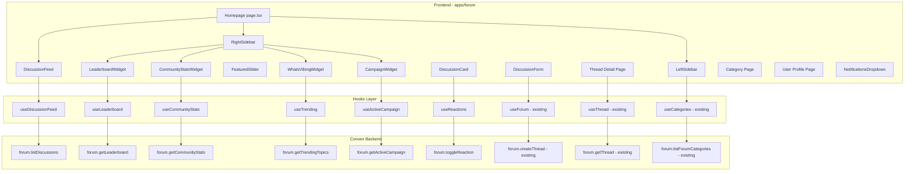

# Forum Live Data Migration — Overview

## Goal

Remove **all hardcoded mock/placeholder data** from the forum application and replace every instance with live data fetched from the Convex database. Ensure the forum is fully functional end-to-end: compose, persist, and display posts in real-time across all views.

## Current State

The forum app (`apps/forum/`) currently renders using:

1. **`apps/forum/src/data/mock-data.ts`** — Central mock file exporting `mockUsers`, `mockCategories`, `mockPremiumCategories`, `mockCampaign`, `mockLeaderboard`, `mockCommunityStats`, `mockDiscussions`, `mockFeaturedDiscussions`
2. **Inline mock functions** — `getThread()`, `getThreadPosts()`, `getCategory()`, `getUser()` defined inside page components with hardcoded objects
3. **Inline hardcoded arrays** — `trendingTopics` in `whats-vibing.tsx`, `mockParticipants` in `discussion-card.tsx`, `mockNotifications` in `notifications-dropdown.tsx`, `defaultCategories` in `sidebar.tsx`, `communityItems` in `community-dropdown.tsx`
4. **Simulated behaviors** — `discussion-form.tsx` fakes submission with `setTimeout`, `discussion-feed.tsx` duplicates mock data for infinite scroll

## Target State

- Every UI component queries Convex directly via reactive `useQuery` hooks
- Post creation calls `useMutation` and persists to the DB
- Leaderboard, stats, trending, and campaigns are all derived from real DB data
- The `mock-data.ts` file and all inline mock functions are deleted
- Types are updated to align with Convex document shapes
- No performance regressions — queries are efficient with proper indexes

## Architecture Diagram

## Phases

| Phase | File | Description |
|-------|------|-------------|
| [Phase 01](./phase-01-backend-queries.md) | `packages/convex/convex/functions/forum.ts` | Add new Convex query functions |
| [Phase 02](./phase-02-frontend-hooks.md) | `apps/forum/src/hooks/` | Create frontend hooks for new queries |
| [Phase 03](./phase-03-homepage-feed.md) | `apps/forum/src/app/page.tsx`, `discussion-feed.tsx` | Wire homepage to live feed |
| [Phase 04](./phase-04-widgets.md) | `apps/forum/src/components/widgets/` | Wire all sidebar widgets to live data |
| [Phase 05](./phase-05-sidebars-form.md) | `left-sidebar.tsx`, `community-dropdown.tsx`, `discussion-form.tsx` | Wire sidebar nav and form submission |
| [Phase 06](./phase-06-detail-pages.md) | `t/[id]/page.tsx`, `c/[slug]/page.tsx`, `u/[username]/page.tsx` | Wire detail pages to live queries |
| [Phase 07](./phase-07-cleanup-verify.md) | Various | Delete mock data, clean imports, verify |

## Key Principles

1. **Convex best practices**: Use indexed queries, avoid `.collect()` on unbounded sets, use `.take(limit)` for pagination, denormalize counts where schema already provides them
2. **No DB overload**: Trending, stats, and leaderboard queries rely on existing indexed/denormalized fields — no full table scans
3. **Reactive by default**: All queries use Convex's real-time subscription model via `useQuery`
4. **Graceful empty states**: Components handle zero-data gracefully with proper empty state UI
5. **Type alignment**: Frontend types evolve to match Convex document shapes returned by queries
