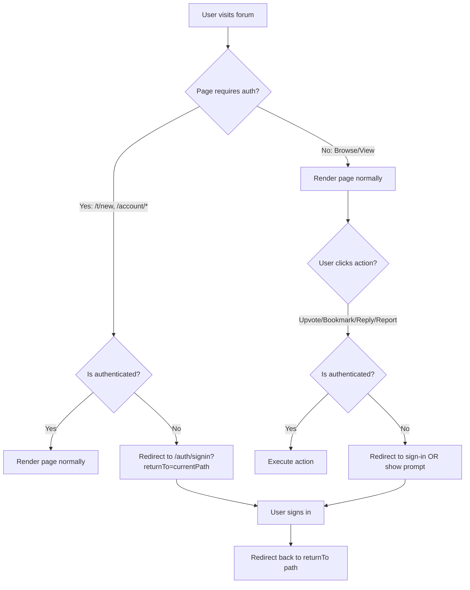

# Forum Read-Only by Default — Auth Gating Plan

## Summary

Make the forum app **read-only by default** for unauthenticated users. All browsing/viewing works without login. Any **write action** (posting, replying, upvoting, bookmarking, reporting, accessing account settings) checks if the user is logged in and redirects to the sign-in page if not, with a return URL so they come back to where they were.

## Current State

- The forum homepage, thread listing, category browsing, and thread viewing all work without authentication ✅
- However, write actions (upvote, bookmark, reply, create thread) either **silently fail** or are **unguarded** — they don't redirect to sign-in
- The [`/t/new`](apps/forum/src/app/t/new/page.tsx) page (create discussion) has **no auth check** at all
- The [`/account/*`](apps/forum/src/app/account/layout.tsx) pages have **no auth guard**
- The [`ReplyForm`](apps/forum/src/components/forum/reply-form.tsx:62) has an `isAuthenticated` prop but it's **hardcoded to `false`** — the caller in [`ThreadPage`](apps/forum/src/app/t/[id]/page.tsx:216) never passes it
- [`DiscussionCard`](apps/forum/src/components/feed/discussion-card.tsx:67) upvote/bookmark actions silently catch errors when user isn't authenticated
- Thread detail page's Like/Share/Report buttons have **no auth gating**

## Approach

1. **Create a reusable [`useRequireAuth`](apps/forum/src/hooks/use-require-auth.ts) hook** — redirects to `/auth/signin?returnTo=<current-path>` if not authenticated
2. **Add `returnTo` query param support** to the sign-in page so users are redirected back after login
3. **Guard pages** that require auth (create discussion, account settings) at the page level
4. **Guard interactive components** (upvote, bookmark, reply, report) at the action level — show sign-in prompt or redirect

## Phases

| Phase | File | Description |
|-------|------|-------------|
| Phase 1 | [phase-01-auth-hooks-and-signin.md](./phase-01-auth-hooks-and-signin.md) | Create `useRequireAuth` hook + update sign-in page for return redirect |
| Phase 2 | [phase-02-page-guards.md](./phase-02-page-guards.md) | Guard `/t/new` and `/account/*` pages |
| Phase 3 | [phase-03-component-action-guards.md](./phase-03-component-action-guards.md) | Guard interactive actions in components |

## Auth Gating Matrix

| Area | Current Behavior | Target Behavior |
|------|-----------------|-----------------|
| Browse homepage feed | ✅ No auth needed | ✅ No auth needed |
| View thread detail | ✅ No auth needed | ✅ No auth needed |
| Browse categories | ✅ No auth needed | ✅ No auth needed |
| Search | ✅ No auth needed | ✅ No auth needed |
| Create discussion `/t/new` | ❌ No guard | ✅ Redirect to sign-in |
| Post reply | ❌ Shows form but submission fails | ✅ Show sign-in prompt |
| Upvote discussion | ❌ Silently fails | ✅ Redirect to sign-in |
| Bookmark discussion | ❌ Silently fails | ✅ Redirect to sign-in |
| Like/Share/Report on thread | ❌ No guard | ✅ Redirect to sign-in |
| Account settings | ❌ No guard | ✅ Redirect to sign-in |
| Start Discussion sidebar btn | ❌ No guard | ✅ Redirect to sign-in |

## Architecture Diagram

## Files Modified

### New Files
- `apps/forum/src/hooks/use-require-auth.ts` — reusable auth-or-redirect hook

### Modified Files
- `apps/forum/src/app/auth/signin/page.tsx` — read `returnTo` param + redirect after login
- `apps/forum/src/components/auth/sign-in-form.tsx` — handle post-login redirect
- `apps/forum/src/app/t/new/page.tsx` — add page-level auth guard
- `apps/forum/src/app/account/layout.tsx` — add auth guard wrapper
- `apps/forum/src/app/t/[id]/page.tsx` — pass auth state to ReplyForm + guard action buttons
- `apps/forum/src/components/forum/reply-form.tsx` — use `useAuth` hook internally instead of prop
- `apps/forum/src/components/feed/discussion-card.tsx` — redirect on upvote/bookmark if not auth
- `apps/forum/src/components/layout/left-sidebar.tsx` — guard "Start Discussion" button
