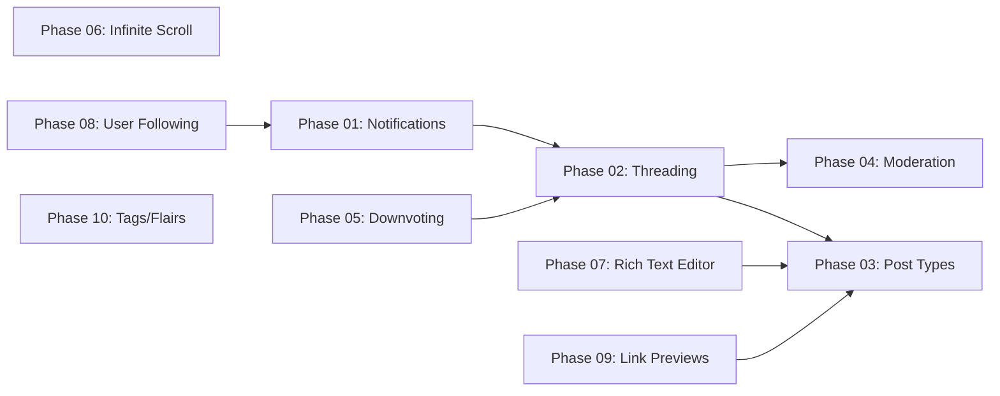

# Forum Reddit-Style Enhancements — Overview

> Implementation plan to bring Createconomy's forum closer to Reddit's feature set while preserving unique advantages (AI summaries, campaigns, gamification, marketplace integration).

## Context

The current forum has a solid foundation: real-time Convex backend, 3-column layout, gamification system, and AI summaries. The gaps compared to Reddit fall into two tiers:

- **Critical (Phases 01–05):** Features whose absence significantly hurts engagement and moderation
- **Medium (Phases 06–10):** Features that improve UX and retention once the critical ones are in place

## Phase Index

| Phase | Title | Priority | Key Deliverable |
|-------|-------|----------|-----------------|
| [Phase 01](./phase-01-notification-system.md) | Notification System | 🔴 Critical | Real-time notifications via Convex with bell badge + inbox page |
| [Phase 02](./phase-02-comment-threading.md) | Comment Threading Refactor | 🔴 Critical | Reddit-style nested comment trees replacing Post→Comment model |
| [Phase 03](./phase-03-post-types.md) | Multiple Post Types | 🔴 Critical | Text, Link, Image, and Poll post types |
| [Phase 04](./phase-04-moderation.md) | Report & Moderation Queue | 🔴 Critical | Report flow + admin moderation dashboard |
| [Phase 05](./phase-05-downvoting.md) | Downvoting & Net Score | 🔴 Critical | Downvote button + net score display + controversial sort |
| [Phase 06](./phase-06-infinite-scroll.md) | Infinite Scroll | 🟡 Medium | Cursor-based pagination with intersection observer |
| [Phase 07](./phase-07-rich-text-editor.md) | Rich Text Editor Upgrade | 🟡 Medium | TipTap WYSIWYG editor with preview, drag-drop images, @mentions |
| [Phase 08](./phase-08-user-following.md) | User Following System | 🟡 Medium | Follow/unfollow users + "Following" feed tab |
| [Phase 09](./phase-09-link-previews.md) | Link Previews & Media Embeds | 🟡 Medium | OG metadata scraping + YouTube/Twitter embeds |
| [Phase 10](./phase-10-tag-flair-system.md) | Tag & Flair System | 🟡 Medium | Persisted tags, mod-managed flairs, user flairs |

## Dependency Graph

**Recommended execution order:** 01 → 05 → 02 → 03 → 04 → 06 → 07 → 08 → 09 → 10

Phase 01 (Notifications) is foundational — many later phases trigger notifications. Phase 05 (Downvoting) is quick and should land before the threading refactor in Phase 02 since comment scoring depends on it.

## Affected Packages

| Package | Changes |
|---------|---------|
| `packages/convex` | Schema additions, new functions, index additions |
| `apps/forum` | New pages, components, hooks |
| `apps/admin` | Moderation queue UI (Phase 04) |
| `packages/ui` | Shared components (comment tree, editor) |

## Architecture Principles

1. **Convex-first**: All data mutations go through Convex. No direct DB writes from client.
2. **Denormalized counts**: Keep `upvoteCount`, `downvoteCount`, `commentCount` on threads for fast reads.
3. **Soft-delete everywhere**: `isDeleted: true, deletedAt: Date.now()`.
4. **Reactive by default**: Leverage Convex subscriptions for real-time updates.
5. **Progressive enhancement**: Each phase is independently deployable and doesn't break existing functionality.
