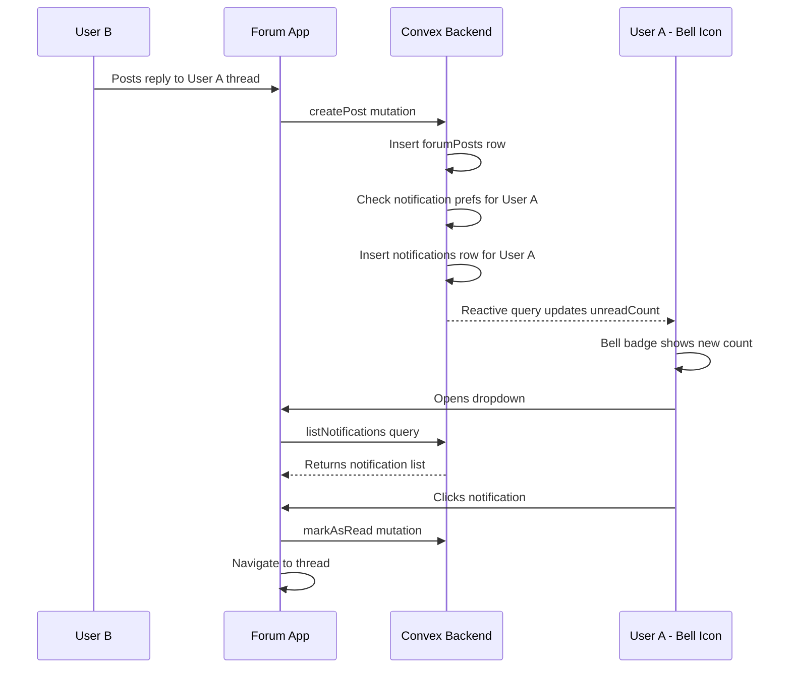

# Phase 01 — Notification System

> **Priority:** 🔴 Critical
> **Depends on:** None (foundational)
> **Enables:** Phase 04 (Moderation reports notify mods), Phase 08 (Follow notifications)

## Problem

The notification UI shell exists in `apps/forum/src/components/navbar/navbar.tsx` with a bell icon, dropdown, and badge count — but it reads from a hardcoded empty array (`const notifications: Notification[] = []`). The settings page at `apps/forum/src/app/account/notifications/page.tsx` simulates save with `setTimeout`. There is no `notifications` table in the Convex schema.

## Goal

Build a real-time notification system backed by Convex that delivers in-app notifications when users receive replies, upvotes, mentions, and other engagement events.

---

## Schema Changes

### New table: `notifications`

```typescript
// packages/convex/convex/schema.ts
notifications: defineTable({
  tenantId: v.optional(v.id("tenants")),
  recipientId: v.id("users"),        // who gets notified
  actorId: v.id("users"),            // who triggered it
  type: v.union(
    v.literal("reply"),
    v.literal("upvote"),
    v.literal("mention"),
    v.literal("follow"),
    v.literal("thread_lock"),
    v.literal("thread_pin"),
    v.literal("mod_action"),
    v.literal("campaign")
  ),
  targetType: v.union(
    v.literal("thread"),
    v.literal("post"),
    v.literal("comment"),
    v.literal("user")
  ),
  targetId: v.string(),              // ID of the target entity
  title: v.string(),                 // short display title
  message: v.string(),               // body text
  read: v.boolean(),
  readAt: v.optional(v.number()),    // epoch ms
  createdAt: v.number(),
  updatedAt: v.number(),
})
  .index("by_recipient", ["recipientId", "createdAt"])
  .index("by_recipient_unread", ["recipientId", "read"])
  .index("by_tenant_recipient", ["tenantId", "recipientId"])
```

### New table: `notificationPreferences`

```typescript
notificationPreferences: defineTable({
  userId: v.id("users"),
  // Per-type toggles
  replyEmail: v.boolean(),
  replyPush: v.boolean(),
  upvoteEmail: v.boolean(),
  upvotePush: v.boolean(),
  mentionEmail: v.boolean(),
  mentionPush: v.boolean(),
  followEmail: v.boolean(),
  followPush: v.boolean(),
  campaignEmail: v.boolean(),
  campaignPush: v.boolean(),
  // Digest
  weeklyDigest: v.boolean(),
  createdAt: v.number(),
  updatedAt: v.number(),
})
  .index("by_user", ["userId"])
```

---

## Backend Functions

### File: `packages/convex/convex/functions/notifications.ts`

#### Queries

| Function | Purpose | Args |
|----------|---------|------|
| `listNotifications` | Paginated list for dropdown/inbox | `recipientId`, `limit`, `cursor`, `unreadOnly?` |
| `getUnreadCount` | Badge count for bell icon | none (uses auth) |
| `getPreferences` | Load notification settings | none (uses auth) |

#### Mutations

| Function | Purpose | Args |
|----------|---------|------|
| `createNotification` | Internal — creates a notification row | `recipientId`, `actorId`, `type`, `targetType`, `targetId`, `title`, `message` |
| `markAsRead` | Mark single notification read | `notificationId` |
| `markAllAsRead` | Mark all notifications read for current user | none |
| `updatePreferences` | Save notification preferences | all pref fields |

#### Integration Points

Existing mutations need to call `createNotification` as a side effect:

| Trigger | File | Notification Type |
|---------|------|------------------|
| New reply to thread | `forum.ts → createPost` | `reply` |
| New comment on post | `forum.ts → createComment` | `reply` |
| Upvote on thread/post | `forum.ts → toggleReaction` | `upvote` (on first upvote only, not toggle-off) |
| @mention in content | `forum.ts → createPost/createComment` | `mention` (parse content for @username) |
| Thread locked/pinned | `forum.ts → updateThread` | `thread_lock` / `thread_pin` |

**Important**: Never notify the actor themselves (e.g., don't notify a user when they upvote their own thread). Check `recipientId !== actorId`.

**Upvote throttle**: Only create upvote notifications at milestones (1, 5, 10, 25, 50, 100, etc.) or with a cooldown period to avoid notification spam.

---

## Frontend Changes

### 1. New hook: `apps/forum/src/hooks/use-notifications.ts`

```typescript
// Wraps Convex queries for notifications
export function useNotifications(limit = 20) {
  const notifications = useQuery(api.functions.notifications.listNotifications, { limit });
  const unreadCount = useQuery(api.functions.notifications.getUnreadCount);
  const markAsRead = useMutation(api.functions.notifications.markAsRead);
  const markAllAsRead = useMutation(api.functions.notifications.markAllAsRead);
  // ...
}
```

### 2. Update `apps/forum/src/components/navbar/navbar.tsx`

- Replace hardcoded `notifications` array with `useNotifications()` hook
- Wire `unreadCount` to the badge
- Clicking a notification: mark as read + navigate to target
- "Mark all as read" button in dropdown header

### 3. New page: `apps/forum/src/app/account/notifications/inbox/page.tsx`

Full-page notification inbox with:
- Filter: All / Unread
- Group by date (Today, Yesterday, This Week, Older)
- Click to navigate to source thread/comment
- Bulk mark as read

### 4. Update `apps/forum/src/app/account/notifications/page.tsx`

- Replace simulated save with `useNotificationPreferences()` hook
- Wire checkboxes to real Convex mutations

---

## Data Flow



---

## Implementation Checklist

- [ ] Add `notifications` table to `packages/convex/convex/schema.ts`
- [ ] Add `notificationPreferences` table to schema
- [ ] Create `packages/convex/convex/functions/notifications.ts` with all queries/mutations
- [ ] Add `createNotification` calls inside `createPost` in `forum.ts`
- [ ] Add `createNotification` calls inside `createComment` in `forum.ts`
- [ ] Add `createNotification` calls inside `toggleReaction` in `forum.ts` (upvote only)
- [ ] Add @mention parsing utility function
- [ ] Create `apps/forum/src/hooks/use-notifications.ts`
- [ ] Update navbar notification dropdown to use live data
- [ ] Create notification inbox page at `/account/notifications/inbox`
- [ ] Update notification preferences page to use Convex mutations
- [ ] Add notification type icons and routing logic
- [ ] Test: verify notifications appear in real-time via Convex reactivity
