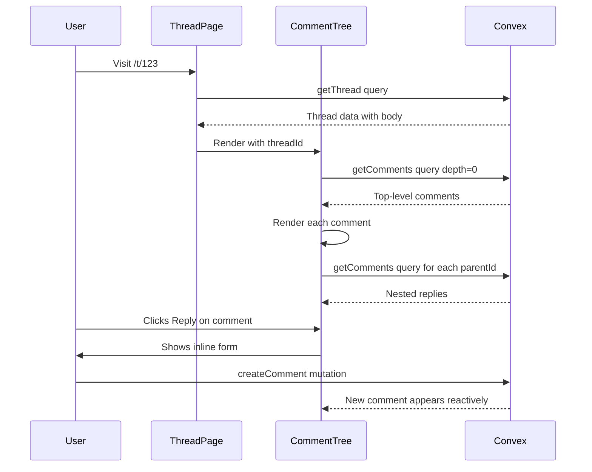

# Phase 02 — Comment Threading Refactor

> **Priority:** 🔴 Critical  
> **Depends on:** Phase 01 (Notifications), Phase 05 (Downvoting)  
> **Enables:** Better engagement, Reddit-like UX

## Problem

The current model is: **Thread → Posts → Comments**

- Posts are flat within a thread (sorted by creation time)
- Only comments on posts support nesting via `parentId`
- This creates confusion: users expect to reply to any content, not navigate a 3-level hierarchy

Reddit's model is: **Thread → Comments (infinitely nested)**

- The thread itself has a body (original post)
- All responses are comments with optional `parentId`
- Enables collapsible trees, "continue thread →" links

## Goal

Simplify to a 2-level model: **Thread → Comments** with Reddit-style nested comment trees.

---

## Schema Changes

### Modify `forumThreads` table

Add a `body` field to store the thread content directly (currently stored as the first `forumPosts` row):

```typescript
// Add to forumThreads
body: v.string(),           // Thread body content (markdown)
bodyHtml: v.optional(v.string()), // Pre-rendered HTML (optional caching)
```

### Rename/repurpose `forumComments` → `comments`

Keep the existing structure but ensure it's the primary reply mechanism:

```typescript
comments: defineTable({
  tenantId: v.optional(v.id("tenants")),
  threadId: v.id("forumThreads"),
  authorId: v.id("users"),
  parentId: v.optional(v.id("comments")),  // For nesting
  content: v.string(),
  contentHtml: v.optional(v.string()),     // Cached rendered HTML
  depth: v.number(),                        // 0 = top-level, 1+ = nested
  upvoteCount: v.number(),
  downvoteCount: v.number(),
  score: v.number(),                        // upvoteCount - downvoteCount
  isCollapsed: v.boolean(),                 // User-collapsed by mods
  isDeleted: v.boolean(),
  deletedAt: v.optional(v.number()),
  createdAt: v.number(),
  updatedAt: v.number(),
})
  .index("by_thread", ["threadId", "createdAt"])
  .index("by_thread_score", ["threadId", "score"])
  .index("by_parent", ["parentId", "createdAt"])
  .index("by_author", ["authorId", "createdAt"])
```

### Update `forumThreads` indexes

Add `commentCount` as a denormalized field:

```typescript
// Add to forumThreads
commentCount: v.number(),  // Replaces postCount
```

### Deprecate `forumPosts`

Keep the table for backward compatibility during migration, but stop using it for new content.

---

## Backend Functions

### File: `packages/convex/convex/functions/forum.ts`

#### New/Modified Queries

| Function | Purpose |
|----------|---------|
| `getThreadWithComments` | Fetch thread + paginated top-level comments with nested replies (depth-limited) |
| `getCommentReplies` | Fetch replies to a specific comment (for "load more replies") |
| `getCommentTree` | Recursively build comment tree up to depth N |

#### New/Modified Mutations

| Function | Purpose |
|----------|---------|
| `createComment` | Create a comment on a thread (replaces `createPost`) |
| `updateComment` | Edit comment content |
| `deleteComment` | Soft-delete a comment (shows "[deleted]" if has children) |
| `collapseComment` | Mod action to collapse a comment branch |

---

## Comment Tree Algorithm

### Display Rules

1. **Top-level comments**: Paginated (20 per page), sorted by score or new
2. **Nested replies**: Load up to 10 replies per parent, depth limit of 10
3. **"More replies" link**: When reply count exceeds loaded amount
4. **"Continue this thread →"**: When depth exceeds 10

### Collapsing Logic

```typescript
interface CommentNode {
  comment: Comment;
  replies: CommentNode[];
  moreRepliesCount: number;  // How many hidden replies exist
  isTruncated: boolean;      // True if depth limit reached
}
```

### Sort Options

| Sort | Algorithm |
|------|-----------|
| Best | Wilson score confidence sort (accounts for sample size) |
| Top | Highest `score` (upvotes - downvotes) |
| New | Most recent `createdAt` |
| Controversial | High total votes, near-equal up/down ratio |
| Q&A | OP replies first, then by score |

---

## Frontend Changes

### 1. New component: `apps/forum/src/components/comments/comment-tree.tsx`

Recursive component that renders the comment tree:

```typescript
interface CommentTreeProps {
  threadId: string;
  parentId?: string;
  depth: number;
  maxDepth: number;
  sortBy: 'best' | 'top' | 'new' | 'controversial';
}

function CommentTree({ threadId, parentId, depth, maxDepth, sortBy }: CommentTreeProps) {
  const { comments, hasMore, loadMore } = useComments(threadId, parentId, sortBy);
  
  if (depth >= maxDepth) {
    return <ContinueThreadLink threadId={threadId} parentId={parentId} />;
  }
  
  return (
    <div className="comment-tree" style={{ marginLeft: depth * 24 }}>
      {comments.map(comment => (
        <CommentNode key={comment.id} comment={comment} depth={depth}>
          <CommentTree 
            threadId={threadId} 
            parentId={comment.id} 
            depth={depth + 1}
            maxDepth={maxDepth}
            sortBy={sortBy}
          />
        </CommentNode>
      ))}
      {hasMore && <LoadMoreButton onClick={loadMore} />}
    </div>
  );
}
```

### 2. New component: `apps/forum/src/components/comments/comment-node.tsx`

Single comment display with:
- Avatar + username + timestamp
- Content (markdown rendered)
- Vote buttons (up/down)
- Reply button (opens inline form)
- Collapse/expand toggle
- More actions menu (report, share, edit if author)

### 3. New component: `apps/forum/src/components/comments/comment-form.tsx`

Inline reply form that appears when "Reply" is clicked:
- Textarea with markdown support
- Submit/Cancel buttons
- Character count
- Error handling

### 4. Update `apps/forum/src/app/t/[id]/page.tsx`

Replace current `PostList` with `CommentTree`:

```typescript
// Old
<PostList posts={[]} originalPostId={id} />

// New
<CommentTree 
  threadId={id} 
  depth={0} 
  maxDepth={10}
  sortBy={commentSort}
/>
```

### 5. Comment sort selector

Add a dropdown above comments to select sort order (Best, Top, New, Controversial, Q&A)

---

## Migration Strategy

### Phase 2a: Parallel Write

1. When creating a new reply, write to both `forumPosts` (legacy) and `comments` (new)
2. Thread view prioritizes `comments` if available, falls back to `forumPosts`

### Phase 2b: Backfill

1. Run a one-time migration to copy existing `forumPosts` to `comments`
2. Convert first posts to thread `body` field
3. Update `commentCount` on all threads

### Phase 2c: Cutover

1. Remove writes to `forumPosts`
2. Update all queries to use `comments` only
3. Mark `forumPosts` as deprecated

---

## Data Flow



---

## Implementation Checklist

- [ ] Add `body` field to `forumThreads` in schema
- [ ] Add `commentCount` field to `forumThreads`
- [ ] Create/update `comments` table with proper indexes
- [ ] Create `getThreadWithComments` query
- [ ] Create `getCommentReplies` query
- [ ] Create `createComment` mutation
- [ ] Create `updateComment` mutation
- [ ] Create `deleteComment` mutation (soft delete with "[deleted]" behavior)
- [ ] Implement Wilson score sorting for "Best"
- [ ] Create `CommentTree` component
- [ ] Create `CommentNode` component
- [ ] Create `CommentForm` component
- [ ] Create `CommentSortSelector` component
- [ ] Update thread page to use new comment system
- [ ] Add "Continue this thread →" links for deep nesting
- [ ] Add "Load more replies" functionality
- [ ] Style collapse/expand animations
- [ ] Wire up notifications for comment replies
- [ ] Write migration script for existing posts → comments
- [ ] Test depth limiting and pagination
