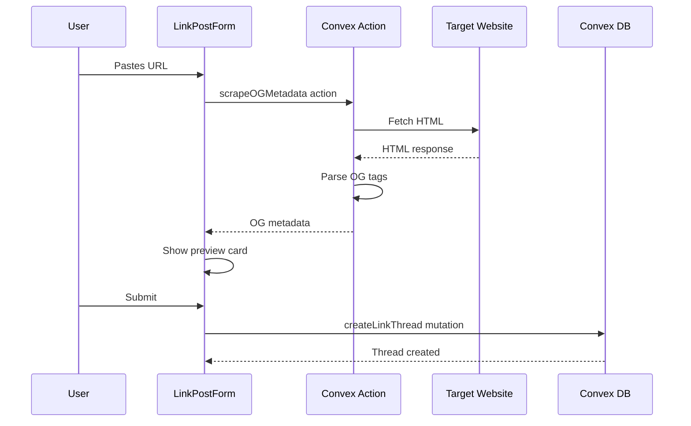

# Phase 03 — Multiple Post Types

> **Priority:** 🔴 Critical  
> **Depends on:** Phase 02 (Comment Threading)  
> **Enables:** Richer content, link sharing, polls, image galleries

## Problem

Currently the forum only supports text posts via `DiscussionForm`. Users can paste URLs and add markdown images, but there's no first-class support for:
- **Link posts** with automatic preview cards
- **Image posts** with galleries
- **Poll posts** for community voting

Reddit supports all these plus video posts. This phase focuses on the three most impactful types.

## Goal

Extend the thread creation flow to support Text, Link, Image, and Poll post types with appropriate UI and storage.

---

## Schema Changes

### Modify `forumThreads` table

```typescript
// Add to forumThreads
postType: v.union(
  v.literal("text"),
  v.literal("link"),
  v.literal("image"),
  v.literal("poll")
),

// Link post fields
linkUrl: v.optional(v.string()),
linkDomain: v.optional(v.string()),      // e.g., "youtube.com"
linkTitle: v.optional(v.string()),       // OG title
linkDescription: v.optional(v.string()), // OG description
linkImage: v.optional(v.string()),       // OG image URL

// Image post fields
images: v.optional(v.array(v.object({
  url: v.string(),
  caption: v.optional(v.string()),
  width: v.optional(v.number()),
  height: v.optional(v.number()),
}))),

// Poll fields
pollOptions: v.optional(v.array(v.string())),
pollEndsAt: v.optional(v.number()),      // epoch ms
pollMultiSelect: v.optional(v.boolean()),
```

### New table: `pollVotes`

```typescript
pollVotes: defineTable({
  threadId: v.id("forumThreads"),
  userId: v.id("users"),
  optionIndex: v.number(),               // Which option they voted for
  createdAt: v.number(),
})
  .index("by_thread", ["threadId"])
  .index("by_thread_user", ["threadId", "userId"])
```

### New table: `threadImages`

For Convex file storage references:

```typescript
threadImages: defineTable({
  threadId: v.id("forumThreads"),
  storageId: v.id("_storage"),           // Convex file storage
  url: v.string(),                        // Generated URL
  caption: v.optional(v.string()),
  sortOrder: v.number(),
  width: v.optional(v.number()),
  height: v.optional(v.number()),
  createdAt: v.number(),
})
  .index("by_thread", ["threadId", "sortOrder"])
```

---

## Backend Functions

### File: `packages/convex/convex/functions/forum.ts`

#### New Mutations

| Function | Purpose |
|----------|---------|
| `createTextThread` | Create a text post (existing behavior, refactored) |
| `createLinkThread` | Create a link post with OG metadata |
| `createImageThread` | Create an image post with uploaded images |
| `createPollThread` | Create a poll with options and end time |
| `votePoll` | Cast a vote on a poll |
| `removePollVote` | Remove user's vote |

#### New Queries

| Function | Purpose |
|----------|---------|
| `getPollResults` | Get vote counts per option + user's vote |
| `getThreadImages` | Get all images for an image post |

### File: `packages/convex/convex/functions/uploads.ts`

#### New Functions

| Function | Purpose |
|----------|---------|
| `generateUploadUrl` | Generate a Convex upload URL for images |
| `saveUploadedImage` | Save uploaded image metadata after upload |

---

## Link Preview Implementation

### Server-side OG Scraping

When creating a link post, the backend should:

1. Validate the URL
2. Fetch Open Graph metadata (title, description, image)
3. Extract domain for display
4. Store all metadata on the thread

```typescript
// packages/convex/convex/lib/og-scraper.ts
interface OGMetadata {
  title: string;
  description: string;
  image: string | null;
  domain: string;
}

// Use Convex HTTP action to fetch and parse OG tags
export const scrapeOGMetadata = action({
  args: { url: v.string() },
  handler: async (ctx, args) => {
    const response = await fetch(args.url);
    const html = await response.text();
    // Parse OG tags from HTML
    return extractOGTags(html, args.url);
  },
});
```

---

## Frontend Changes

### 1. Update `apps/forum/src/components/discussion/discussion-form.tsx`

Add post type selector tabs:

```typescript
const postTypes = [
  { id: 'text', label: 'Text', icon: FileText },
  { id: 'link', label: 'Link', icon: Link2 },
  { id: 'image', label: 'Image', icon: Image },
  { id: 'poll', label: 'Poll', icon: BarChart },
];

// Render different form based on selected type
{postType === 'text' && <TextPostForm />}
{postType === 'link' && <LinkPostForm />}
{postType === 'image' && <ImagePostForm />}
{postType === 'poll' && <PollPostForm />}
```

### 2. New component: `apps/forum/src/components/discussion/link-post-form.tsx`

```typescript
interface LinkPostFormProps {
  onUrlChange: (url: string, metadata: OGMetadata | null) => void;
}

function LinkPostForm({ onUrlChange }: LinkPostFormProps) {
  const [url, setUrl] = useState('');
  const [isLoading, setIsLoading] = useState(false);
  const [preview, setPreview] = useState<OGMetadata | null>(null);
  
  // Debounced URL validation and preview fetch
  useEffect(() => {
    if (isValidUrl(url)) {
      fetchOGPreview(url).then(setPreview);
    }
  }, [url]);
  
  return (
    <div>
      <Input 
        type="url" 
        placeholder="https://example.com/article" 
        value={url}
        onChange={(e) => setUrl(e.target.value)}
      />
      {preview && <LinkPreviewCard metadata={preview} />}
    </div>
  );
}
```

### 3. New component: `apps/forum/src/components/discussion/image-post-form.tsx`

```typescript
function ImagePostForm() {
  const [images, setImages] = useState<UploadedImage[]>([]);
  const { generateUrl, upload } = useImageUpload();
  
  const handleDrop = async (files: File[]) => {
    for (const file of files) {
      const uploadUrl = await generateUrl();
      await upload(uploadUrl, file);
      // Add to images array
    }
  };
  
  return (
    <div>
      <DropZone onDrop={handleDrop} maxFiles={10} />
      <ImageGrid images={images} onReorder={setImages} onRemove={...} />
    </div>
  );
}
```

### 4. New component: `apps/forum/src/components/discussion/poll-post-form.tsx`

```typescript
function PollPostForm() {
  const [options, setOptions] = useState(['', '']);
  const [endsIn, setEndsIn] = useState('3'); // days
  const [multiSelect, setMultiSelect] = useState(false);
  
  return (
    <div>
      {options.map((option, i) => (
        <Input 
          key={i}
          value={option}
          onChange={(e) => updateOption(i, e.target.value)}
          placeholder={`Option ${i + 1}`}
        />
      ))}
      <Button onClick={() => setOptions([...options, ''])}>Add Option</Button>
      
      <Select value={endsIn} onChange={setEndsIn}>
        <option value="1">1 day</option>
        <option value="3">3 days</option>
        <option value="7">7 days</option>
      </Select>
      
      <Checkbox checked={multiSelect} onChange={setMultiSelect}>
        Allow multiple selections
      </Checkbox>
    </div>
  );
}
```

### 5. Update `apps/forum/src/components/feed/discussion-card.tsx`

Render different content based on `postType`:

```typescript
function DiscussionCard({ discussion }) {
  return (
    <article>
      {/* Header with author, timestamp */}
      
      {/* Type-specific content */}
      {discussion.postType === 'text' && (
        <p className="line-clamp-3">{discussion.body}</p>
      )}
      
      {discussion.postType === 'link' && (
        <LinkPreviewCard 
          url={discussion.linkUrl}
          title={discussion.linkTitle}
          image={discussion.linkImage}
          domain={discussion.linkDomain}
        />
      )}
      
      {discussion.postType === 'image' && (
        <ImageGalleryPreview images={discussion.images} />
      )}
      
      {discussion.postType === 'poll' && (
        <PollPreview 
          options={discussion.pollOptions}
          endsAt={discussion.pollEndsAt}
        />
      )}
      
      {/* Footer with upvotes, comments */}
    </article>
  );
}
```

### 6. New component: `apps/forum/src/components/thread/poll-widget.tsx`

Full poll voting UI for thread detail page:

```typescript
function PollWidget({ threadId, options, endsAt, multiSelect }) {
  const { results, userVote, vote, removeVote, isLoading } = usePoll(threadId);
  const hasEnded = endsAt && Date.now() > endsAt;
  
  return (
    <div className="poll-widget">
      {options.map((option, index) => {
        const percentage = results?.percentages[index] || 0;
        const isSelected = userVote?.includes(index);
        
        return (
          <button
            key={index}
            onClick={() => !hasEnded && vote(index)}
            disabled={hasEnded}
            className={isSelected ? 'selected' : ''}
          >
            <span>{option}</span>
            {results && (
              <div className="progress" style={{ width: `${percentage}%` }} />
            )}
            <span>{percentage}%</span>
          </button>
        );
      })}
      
      <div className="poll-meta">
        <span>{results?.totalVotes} votes</span>
        {hasEnded ? (
          <span>Poll ended</span>
        ) : (
          <span>Ends in {formatDistanceToNow(endsAt)}</span>
        )}
      </div>
    </div>
  );
}
```

---

## Data Flow: Link Post



---

## Implementation Checklist

- [ ] Add `postType` and type-specific fields to `forumThreads` schema
- [ ] Create `pollVotes` table
- [ ] Create `threadImages` table
- [ ] Create `scrapeOGMetadata` HTTP action
- [ ] Create `createTextThread` mutation (refactor existing)
- [ ] Create `createLinkThread` mutation with OG scraping
- [ ] Create `createImageThread` mutation with file storage
- [ ] Create `createPollThread` mutation
- [ ] Create `votePoll` and `removePollVote` mutations
- [ ] Create `getPollResults` query
- [ ] Create `generateUploadUrl` for image uploads
- [ ] Add post type tabs to discussion form
- [ ] Create `LinkPostForm` component
- [ ] Create `ImagePostForm` component with drag-drop
- [ ] Create `PollPostForm` component
- [ ] Update discussion card to render by type
- [ ] Create `LinkPreviewCard` component
- [ ] Create `ImageGalleryPreview` component
- [ ] Create `PollWidget` for thread detail
- [ ] Create `PollPreview` for feed cards
- [ ] Add image upload progress indicator
- [ ] Add image reordering with drag-and-drop
- [ ] Style poll progress bars with animations
- [ ] Handle poll end time display and voting lock
