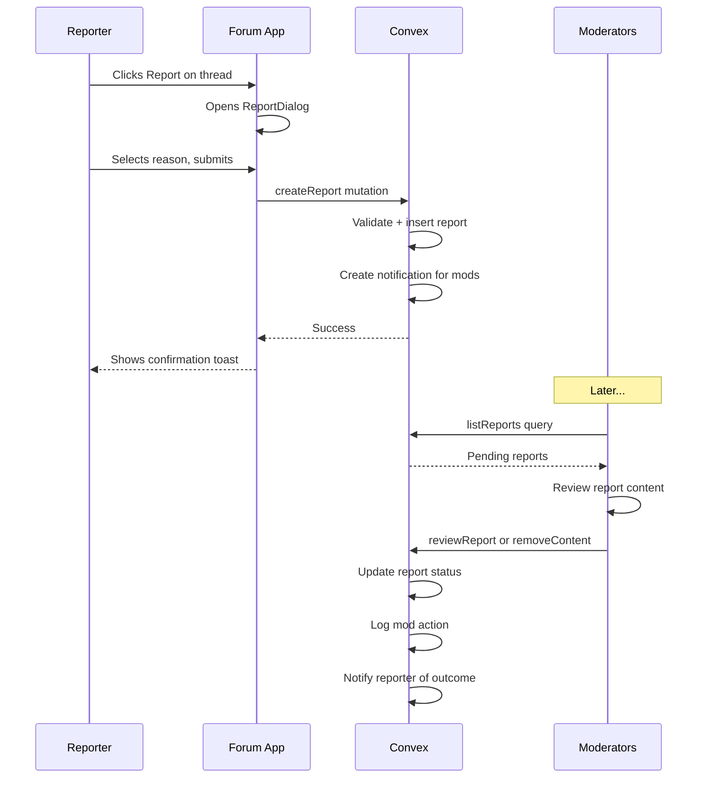

# Phase 04 — Report & Moderation Queue

> **Priority:** 🔴 Critical  
> **Depends on:** Phase 01 (Notifications to notify mods), Phase 02 (Comments to report)  
> **Enables:** Community safety, rule enforcement, moderator tools

## Problem

The current moderation capabilities are minimal:
- Basic pin/lock/delete actions exist in `forum.ts`
- Report buttons in `discussion-card.tsx` are marked as TODO
- No `reports` table exists in the schema
- The admin app has empty moderation pages at `apps/admin/src/app/moderation/`

Reddit has comprehensive moderation: report reasons, mod queue, AutoMod, removal reasons, mod mail, and ban management.

## Goal

Build a functional report system and moderation queue that allows users to report content and moderators to review and act on reports.

---

## Schema Changes

### New table: `reports`

```typescript
reports: defineTable({
  tenantId: v.optional(v.id("tenants")),
  reporterId: v.id("users"),
  targetType: v.union(
    v.literal("thread"),
    v.literal("comment"),
    v.literal("user")
  ),
  targetId: v.string(),
  targetAuthorId: v.id("users"),           // Who created the reported content
  reason: v.union(
    v.literal("spam"),
    v.literal("harassment"),
    v.literal("hate_speech"),
    v.literal("misinformation"),
    v.literal("nsfw"),
    v.literal("off_topic"),
    v.literal("self_harm"),
    v.literal("violence"),
    v.literal("other")
  ),
  details: v.optional(v.string()),          // Additional context from reporter
  status: v.union(
    v.literal("pending"),
    v.literal("reviewed"),
    v.literal("actioned"),
    v.literal("dismissed")
  ),
  reviewedBy: v.optional(v.id("users")),    // Moderator who reviewed
  reviewedAt: v.optional(v.number()),
  actionTaken: v.optional(v.union(
    v.literal("none"),
    v.literal("removed"),
    v.literal("warned"),
    v.literal("banned")
  )),
  modNotes: v.optional(v.string()),         // Internal mod notes
  createdAt: v.number(),
  updatedAt: v.number(),
})
  .index("by_status", ["status", "createdAt"])
  .index("by_target", ["targetType", "targetId"])
  .index("by_reporter", ["reporterId", "createdAt"])
  .index("by_target_author", ["targetAuthorId", "createdAt"])
```

### New table: `modActions`

Log all moderation actions for audit trail:

```typescript
modActions: defineTable({
  tenantId: v.optional(v.id("tenants")),
  moderatorId: v.id("users"),
  targetType: v.union(
    v.literal("thread"),
    v.literal("comment"),
    v.literal("user")
  ),
  targetId: v.string(),
  action: v.union(
    v.literal("remove"),
    v.literal("approve"),
    v.literal("lock"),
    v.literal("unlock"),
    v.literal("pin"),
    v.literal("unpin"),
    v.literal("warn"),
    v.literal("ban"),
    v.literal("unban"),
    v.literal("mute"),
    v.literal("unmute")
  ),
  reason: v.optional(v.string()),
  reportId: v.optional(v.id("reports")),    // If action was from a report
  createdAt: v.number(),
})
  .index("by_moderator", ["moderatorId", "createdAt"])
  .index("by_target", ["targetType", "targetId", "createdAt"])
```

### New table: `userBans`

Track user bans:

```typescript
userBans: defineTable({
  tenantId: v.optional(v.id("tenants")),
  userId: v.id("users"),
  bannedBy: v.id("users"),
  reason: v.string(),
  isPermanent: v.boolean(),
  expiresAt: v.optional(v.number()),        // For temp bans
  isActive: v.boolean(),
  createdAt: v.number(),
  updatedAt: v.number(),
})
  .index("by_user", ["userId", "isActive"])
  .index("by_active", ["isActive", "expiresAt"])
```

### Update `userProfiles` table

Add mute functionality:

```typescript
// Add to userProfiles
isMuted: v.optional(v.boolean()),
mutedUntil: v.optional(v.number()),
warnCount: v.optional(v.number()),          // Warning counter
```

---

## Backend Functions

### File: `packages/convex/convex/functions/moderation.ts`

#### Queries

| Function | Purpose |
|----------|---------|
| `listReports` | Paginated list for mod queue, filterable by status/type |
| `getReport` | Single report with full context |
| `getModActions` | Audit log for a target or moderator |
| `getUserBanStatus` | Check if user is banned |
| `getModStats` | Dashboard stats: pending reports, actions today, etc. |

#### Mutations

| Function | Purpose |
|----------|---------|
| `createReport` | Submit a report (rate-limited) |
| `reviewReport` | Mark report as reviewed with action |
| `dismissReport` | Dismiss as not actionable |
| `removeContent` | Remove thread/comment with reason |
| `approveContent` | Clear content from queue |
| `warnUser` | Send warning to user |
| `banUser` | Ban user (temp or permanent) |
| `unbanUser` | Remove ban |
| `muteUser` | Prevent user from posting temporarily |

### Integration with Existing Functions

Update `forum.ts` mutations to check ban status:

```typescript
// In createThread, createComment, etc.
const banStatus = await ctx.runQuery(api.moderation.getUserBanStatus, { userId });
if (banStatus?.isActive) {
  throw new Error("You are banned from posting");
}
```

---

## Frontend Changes (Forum App)

### 1. New component: `apps/forum/src/components/moderation/report-dialog.tsx`

Modal dialog for submitting reports:

```typescript
interface ReportDialogProps {
  targetType: 'thread' | 'comment' | 'user';
  targetId: string;
  isOpen: boolean;
  onClose: () => void;
}

function ReportDialog({ targetType, targetId, isOpen, onClose }: ReportDialogProps) {
  const [reason, setReason] = useState<ReportReason | null>(null);
  const [details, setDetails] = useState('');
  const createReport = useMutation(api.moderation.createReport);
  
  const reasons = [
    { value: 'spam', label: 'Spam', description: 'Unsolicited advertising or promotion' },
    { value: 'harassment', label: 'Harassment', description: 'Targeting or bullying a person' },
    { value: 'hate_speech', label: 'Hate Speech', description: 'Discrimination based on identity' },
    // ... more reasons
  ];
  
  return (
    <Dialog open={isOpen} onClose={onClose}>
      <DialogTitle>Report Content</DialogTitle>
      <DialogContent>
        <RadioGroup value={reason} onChange={setReason}>
          {reasons.map(r => (
            <RadioOption key={r.value} value={r.value}>
              <span className="font-medium">{r.label}</span>
              <span className="text-sm text-muted">{r.description}</span>
            </RadioOption>
          ))}
        </RadioGroup>
        
        {reason === 'other' && (
          <Textarea 
            value={details}
            onChange={(e) => setDetails(e.target.value)}
            placeholder="Please describe the issue..."
            maxLength={500}
          />
        )}
      </DialogContent>
      <DialogActions>
        <Button variant="ghost" onClick={onClose}>Cancel</Button>
        <Button onClick={handleSubmit} disabled={!reason}>Submit Report</Button>
      </DialogActions>
    </Dialog>
  );
}
```

### 2. Update `discussion-card.tsx` and comment components

Wire up the report button:

```typescript
const [showReportDialog, setShowReportDialog] = useState(false);

// In the dropdown menu
<DropdownMenuItem onClick={() => {
  requireAuth(() => setShowReportDialog(true));
}}>
  <Flag className="h-4 w-4 mr-2" />
  Report
</DropdownMenuItem>

<ReportDialog 
  targetType="thread" 
  targetId={discussion.id}
  isOpen={showReportDialog}
  onClose={() => setShowReportDialog(false)}
/>
```

---

## Frontend Changes (Admin App)

### 3. Update `apps/admin/src/app/moderation/page.tsx`

Moderation dashboard with stats:

```typescript
function ModerationDashboard() {
  const stats = useQuery(api.moderation.getModStats);
  
  return (
    <div>
      <h1>Moderation Overview</h1>
      
      <div className="grid grid-cols-4 gap-4">
        <StatCard 
          label="Pending Reports" 
          value={stats?.pendingReports} 
          variant="warning"
        />
        <StatCard 
          label="Reviewed Today" 
          value={stats?.reviewedToday} 
        />
        <StatCard 
          label="Actions This Week" 
          value={stats?.actionsThisWeek} 
        />
        <StatCard 
          label="Active Bans" 
          value={stats?.activeBans} 
        />
      </div>
      
      <Tabs>
        <Tab label="Reports Queue">
          <ReportsQueue />
        </Tab>
        <Tab label="Recent Actions">
          <ModActionsLog />
        </Tab>
        <Tab label="Bans">
          <BansList />
        </Tab>
      </Tabs>
    </div>
  );
}
```

### 4. Update `apps/admin/src/app/moderation/reports/page.tsx`

Reports queue with filters and actions:

```typescript
function ReportsQueue() {
  const [statusFilter, setStatusFilter] = useState('pending');
  const [typeFilter, setTypeFilter] = useState('all');
  const reports = useQuery(api.moderation.listReports, { 
    status: statusFilter,
    targetType: typeFilter === 'all' ? undefined : typeFilter,
  });
  
  return (
    <div>
      <div className="flex gap-4 mb-4">
        <Select value={statusFilter} onChange={setStatusFilter}>
          <option value="pending">Pending</option>
          <option value="reviewed">Reviewed</option>
          <option value="actioned">Actioned</option>
          <option value="dismissed">Dismissed</option>
        </Select>
        
        <Select value={typeFilter} onChange={setTypeFilter}>
          <option value="all">All Types</option>
          <option value="thread">Threads</option>
          <option value="comment">Comments</option>
          <option value="user">Users</option>
        </Select>
      </div>
      
      <div className="space-y-4">
        {reports?.map(report => (
          <ReportCard key={report._id} report={report} />
        ))}
      </div>
    </div>
  );
}
```

### 5. New component: `apps/admin/src/components/moderation/report-card.tsx`

Individual report review card:

```typescript
function ReportCard({ report }) {
  const [showContent, setShowContent] = useState(false);
  const reviewReport = useMutation(api.moderation.reviewReport);
  const dismissReport = useMutation(api.moderation.dismissReport);
  const removeContent = useMutation(api.moderation.removeContent);
  
  return (
    <Card>
      <CardHeader>
        <div className="flex justify-between">
          <Badge variant={report.reason}>{report.reason}</Badge>
          <span className="text-sm text-muted">
            {formatDistanceToNow(report.createdAt)} ago
          </span>
        </div>
      </CardHeader>
      
      <CardContent>
        <div className="mb-4">
          <p className="text-sm">
            <span className="font-medium">Reported by:</span> @{report.reporter.username}
          </p>
          <p className="text-sm">
            <span className="font-medium">Target:</span> {report.targetType} by @{report.targetAuthor.username}
          </p>
          {report.details && (
            <p className="text-sm mt-2">{report.details}</p>
          )}
        </div>
        
        <Button variant="outline" onClick={() => setShowContent(!showContent)}>
          {showContent ? 'Hide' : 'View'} Reported Content
        </Button>
        
        {showContent && (
          <div className="mt-4 p-4 bg-muted rounded-lg">
            <ReportedContentPreview 
              type={report.targetType} 
              id={report.targetId} 
            />
          </div>
        )}
      </CardContent>
      
      <CardFooter className="flex gap-2">
        <Button 
          variant="destructive" 
          onClick={() => removeContent({ 
            reportId: report._id,
            reason: 'Violated community guidelines'
          })}
        >
          Remove
        </Button>
        <Button 
          variant="outline"
          onClick={() => dismissReport({ reportId: report._id })}
        >
          Dismiss
        </Button>
        <Button 
          variant="secondary"
          onClick={() => warnUser({ userId: report.targetAuthorId })}
        >
          Warn User
        </Button>
        <Button 
          variant="destructive"
          onClick={() => banUser({ userId: report.targetAuthorId })}
        >
          Ban User
        </Button>
      </CardFooter>
    </Card>
  );
}
```

---

## Data Flow: Report Submission



---

## Rate Limiting

Prevent report abuse:

```typescript
// In createReport mutation
await checkRateLimitWithDb(ctx, {
  action: 'report',
  identifier: userId,
  maxRequests: 10,
  windowMs: 3600000, // 10 reports per hour
});
```

---

## Implementation Checklist

- [ ] Create `reports` table in schema
- [ ] Create `modActions` table for audit log
- [ ] Create `userBans` table
- [ ] Add mute fields to `userProfiles`
- [ ] Create `packages/convex/convex/functions/moderation.ts`
- [ ] Implement `createReport` mutation with rate limiting
- [ ] Implement `listReports` query with filters
- [ ] Implement `reviewReport` mutation
- [ ] Implement `dismissReport` mutation
- [ ] Implement `removeContent` mutation
- [ ] Implement `warnUser` mutation
- [ ] Implement `banUser` mutation
- [ ] Implement `unbanUser` mutation
- [ ] Implement `getUserBanStatus` query
- [ ] Add ban check to thread/comment creation
- [ ] Create `ReportDialog` component in forum app
- [ ] Wire up report buttons in discussion-card.tsx
- [ ] Wire up report buttons in comment components
- [ ] Update admin moderation dashboard
- [ ] Create `ReportsQueue` component
- [ ] Create `ReportCard` component
- [ ] Create `ReportedContentPreview` component
- [ ] Create `ModActionsLog` component
- [ ] Create `BansList` component
- [ ] Add success/error toasts for mod actions
- [ ] Send notification to moderators on new reports
- [ ] Send notification to reporter when report is resolved
