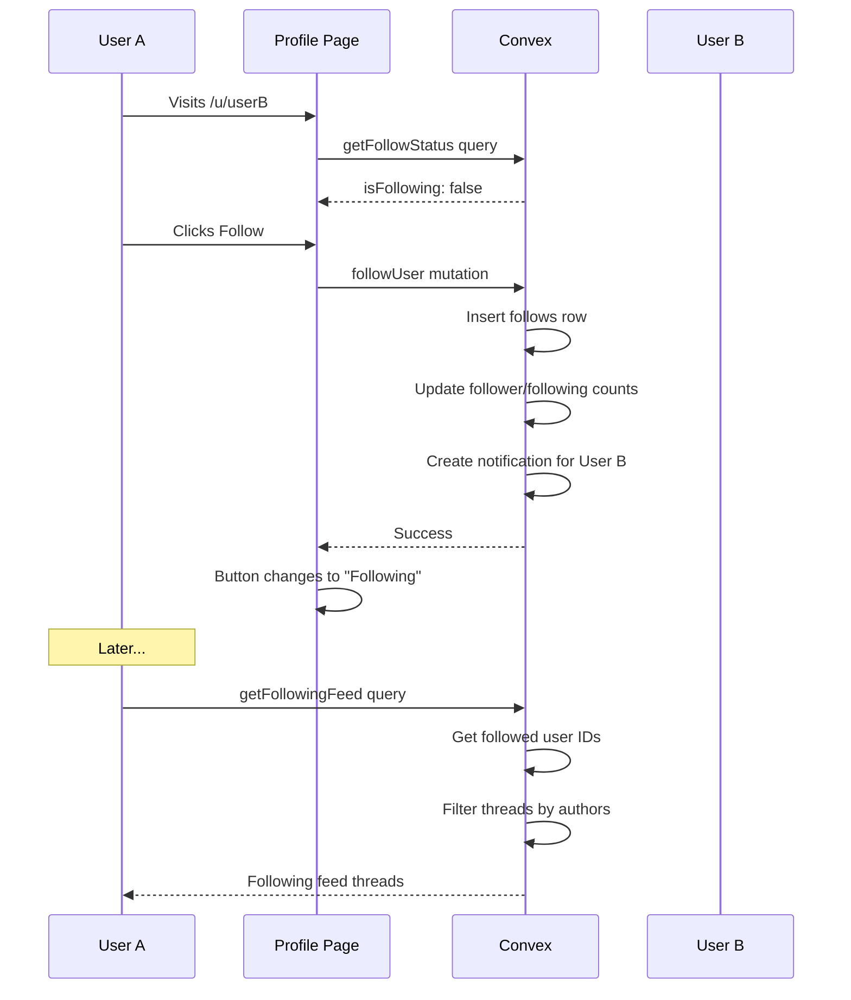

# Phase 08 — User Following System

> **Priority:** 🟡 Medium  
> **Depends on:** Phase 01 (Notifications for follow events)  
> **Enables:** Personalized "Following" feed, social connections

## Problem

Currently users cannot follow other users. There's no way to:
- See updates from favorite creators
- Get notified when followed users post
- Build social connections within the community

Reddit allows following users to see their posts in a dedicated feed.

## Goal

Add follow/unfollow functionality with a "Following" feed tab.

---

## Schema Changes

### New table: `follows`

```typescript
follows: defineTable({
  tenantId: v.optional(v.id("tenants")),
  followerId: v.id("users"),        // Who is following
  followeeId: v.id("users"),        // Who is being followed
  createdAt: v.number(),
})
  .index("by_follower", ["followerId", "createdAt"])
  .index("by_followee", ["followeeId", "createdAt"])
  .index("by_pair", ["followerId", "followeeId"])  // Unique pair check
```

### Update `userProfiles` table

Add denormalized counts:

```typescript
// Add to userProfiles
followerCount: v.optional(v.number()),
followingCount: v.optional(v.number()),
```

---

## Backend Functions

### File: `packages/convex/convex/functions/social.ts`

#### Queries

| Function | Purpose |
|----------|---------|
| `getFollowStatus` | Check if current user follows a target user |
| `getFollowers` | List followers of a user (paginated) |
| `getFollowing` | List users that a user follows (paginated) |
| `getFollowCounts` | Get follower/following counts for a user |

#### Mutations

| Function | Purpose |
|----------|---------|
| `followUser` | Follow a user |
| `unfollowUser` | Unfollow a user |

### Implementation

```typescript
// packages/convex/convex/functions/social.ts

import { query, mutation } from "../_generated/server";
import { v } from "convex/values";
import { getAuthUserId } from "@convex-dev/auth/server";

export const followUser = mutation({
  args: { userId: v.id("users") },
  handler: async (ctx, args) => {
    const followerId = await getAuthUserId(ctx);
    if (!followerId) throw new Error("Authentication required");
    
    // Can't follow yourself
    if (followerId === args.userId) {
      throw new Error("Cannot follow yourself");
    }
    
    // Check if already following
    const existing = await ctx.db
      .query("follows")
      .withIndex("by_pair", (q) => 
        q.eq("followerId", followerId).eq("followeeId", args.userId)
      )
      .first();
    
    if (existing) {
      throw new Error("Already following this user");
    }
    
    // Create follow
    await ctx.db.insert("follows", {
      followerId,
      followeeId: args.userId,
      createdAt: Date.now(),
    });
    
    // Update follower's followingCount
    const followerProfile = await ctx.db
      .query("userProfiles")
      .withIndex("by_user", (q) => q.eq("userId", followerId))
      .first();
    
    if (followerProfile) {
      await ctx.db.patch(followerProfile._id, {
        followingCount: (followerProfile.followingCount ?? 0) + 1,
      });
    }
    
    // Update followee's followerCount
    const followeeProfile = await ctx.db
      .query("userProfiles")
      .withIndex("by_user", (q) => q.eq("userId", args.userId))
      .first();
    
    if (followeeProfile) {
      await ctx.db.patch(followeeProfile._id, {
        followerCount: (followeeProfile.followerCount ?? 0) + 1,
      });
    }
    
    // Create notification (via Phase 01)
    await ctx.runMutation(api.notifications.createNotification, {
      recipientId: args.userId,
      actorId: followerId,
      type: "follow",
      targetType: "user",
      targetId: followerId,
      title: "New follower",
      message: `Someone started following you`,
    });
    
    return { success: true };
  },
});

export const unfollowUser = mutation({
  args: { userId: v.id("users") },
  handler: async (ctx, args) => {
    const followerId = await getAuthUserId(ctx);
    if (!followerId) throw new Error("Authentication required");
    
    const existing = await ctx.db
      .query("follows")
      .withIndex("by_pair", (q) => 
        q.eq("followerId", followerId).eq("followeeId", args.userId)
      )
      .first();
    
    if (!existing) {
      throw new Error("Not following this user");
    }
    
    await ctx.db.delete(existing._id);
    
    // Update counts
    const followerProfile = await ctx.db
      .query("userProfiles")
      .withIndex("by_user", (q) => q.eq("userId", followerId))
      .first();
    
    if (followerProfile) {
      await ctx.db.patch(followerProfile._id, {
        followingCount: Math.max(0, (followerProfile.followingCount ?? 1) - 1),
      });
    }
    
    const followeeProfile = await ctx.db
      .query("userProfiles")
      .withIndex("by_user", (q) => q.eq("userId", args.userId))
      .first();
    
    if (followeeProfile) {
      await ctx.db.patch(followeeProfile._id, {
        followerCount: Math.max(0, (followeeProfile.followerCount ?? 1) - 1),
      });
    }
    
    return { success: true };
  },
});

export const getFollowStatus = query({
  args: { userId: v.id("users") },
  handler: async (ctx, args) => {
    const currentUserId = await getAuthUserId(ctx);
    if (!currentUserId) return { isFollowing: false };
    
    const follow = await ctx.db
      .query("follows")
      .withIndex("by_pair", (q) => 
        q.eq("followerId", currentUserId).eq("followeeId", args.userId)
      )
      .first();
    
    return { isFollowing: !!follow };
  },
});

export const getFollowers = query({
  args: { 
    userId: v.id("users"),
    limit: v.optional(v.number()),
    cursor: v.optional(v.id("follows")),
  },
  handler: async (ctx, args) => {
    const limit = args.limit ?? 20;
    
    let query = ctx.db
      .query("follows")
      .withIndex("by_followee", (q) => q.eq("followeeId", args.userId))
      .order("desc");
    
    const follows = await query.take(limit + 1);
    const hasMore = follows.length > limit;
    const items = hasMore ? follows.slice(0, limit) : follows;
    
    // Enrich with user data
    const followers = await Promise.all(
      items.map(async (follow) => {
        const profile = await ctx.db
          .query("userProfiles")
          .withIndex("by_user", (q) => q.eq("userId", follow.followerId))
          .first();
        
        return {
          userId: follow.followerId,
          username: profile?.username ?? "unknown",
          displayName: profile?.displayName ?? "Anonymous",
          avatarUrl: profile?.avatarUrl ?? null,
          followedAt: follow.createdAt,
        };
      })
    );
    
    return {
      followers,
      hasMore,
      nextCursor: hasMore ? items[items.length - 1]?._id : null,
    };
  },
});

export const getFollowing = query({
  args: { 
    userId: v.id("users"),
    limit: v.optional(v.number()),
  },
  handler: async (ctx, args) => {
    const limit = args.limit ?? 20;
    
    const follows = await ctx.db
      .query("follows")
      .withIndex("by_follower", (q) => q.eq("followerId", args.userId))
      .order("desc")
      .take(limit);
    
    // Enrich with user data
    const following = await Promise.all(
      follows.map(async (follow) => {
        const profile = await ctx.db
          .query("userProfiles")
          .withIndex("by_user", (q) => q.eq("userId", follow.followeeId))
          .first();
        
        return {
          userId: follow.followeeId,
          username: profile?.username ?? "unknown",
          displayName: profile?.displayName ?? "Anonymous",
          avatarUrl: profile?.avatarUrl ?? null,
          followedAt: follow.createdAt,
        };
      })
    );
    
    return following;
  },
});
```

### Following Feed Query

```typescript
// Add to forum.ts
export const getFollowingFeed = query({
  args: {
    limit: v.optional(v.number()),
    cursor: v.optional(v.string()),
  },
  handler: async (ctx, args) => {
    const userId = await getAuthUserId(ctx);
    if (!userId) return { discussions: [], hasMore: false };
    
    const limit = args.limit ?? 20;
    
    // Get users the current user follows
    const follows = await ctx.db
      .query("follows")
      .withIndex("by_follower", (q) => q.eq("followerId", userId))
      .collect();
    
    const followedUserIds = follows.map(f => f.followeeId);
    
    if (followedUserIds.length === 0) {
      return { discussions: [], hasMore: false };
    }
    
    // Get threads from followed users
    const threads = await ctx.db
      .query("forumThreads")
      .filter((q) => q.eq(q.field("isDeleted"), false))
      .order("desc")
      .take(limit * 3); // Fetch extra to filter
    
    // Filter to only followed users
    const filteredThreads = threads.filter(t => 
      followedUserIds.includes(t.authorId)
    ).slice(0, limit + 1);
    
    const hasMore = filteredThreads.length > limit;
    const result = hasMore ? filteredThreads.slice(0, limit) : filteredThreads;
    
    // Enrich with author data
    // ... same enrichment as listDiscussions
    
    return {
      discussions: enriched,
      hasMore,
    };
  },
});
```

---

## Frontend Changes

### 1. New hook: `apps/forum/src/hooks/use-follow.ts`

```typescript
export function useFollow(userId: string) {
  const followStatus = useQuery(api.social.getFollowStatus, { userId });
  const followMutation = useMutation(api.social.followUser);
  const unfollowMutation = useMutation(api.social.unfollowUser);
  
  const toggle = useCallback(async () => {
    if (followStatus?.isFollowing) {
      await unfollowMutation({ userId });
    } else {
      await followMutation({ userId });
    }
  }, [followStatus?.isFollowing, userId]);
  
  return {
    isFollowing: followStatus?.isFollowing ?? false,
    isLoading: followStatus === undefined,
    toggle,
  };
}
```

### 2. Update user profile page: `apps/forum/src/app/u/[username]/page.tsx`

Add follow button and follower/following counts:

```typescript
function UserProfilePage() {
  const { profile, isLoading } = useUserProfile(username);
  const { isFollowing, toggle, isLoading: followLoading } = useFollow(profile?.userId);
  const { requireAuth } = useAuthAction();
  const { user } = useAuth();
  
  const isOwnProfile = user?.id === profile?.userId;
  
  return (
    <div>
      {/* Profile header */}
      <div className="flex items-center gap-4">
        <Avatar className="h-24 w-24" />
        <div>
          <h1>{profile.displayName}</h1>
          <p>@{profile.username}</p>
          
          {/* Follow stats */}
          <div className="flex gap-4 mt-2">
            <Link href={`/u/${username}/followers`}>
              <span className="font-bold">{profile.followerCount ?? 0}</span>
              <span className="text-muted-foreground"> followers</span>
            </Link>
            <Link href={`/u/${username}/following`}>
              <span className="font-bold">{profile.followingCount ?? 0}</span>
              <span className="text-muted-foreground"> following</span>
            </Link>
          </div>
        </div>
        
        {/* Follow button */}
        {!isOwnProfile && (
          <Button
            onClick={() => requireAuth(toggle)}
            variant={isFollowing ? "outline" : "default"}
            disabled={followLoading}
          >
            {isFollowing ? "Following" : "Follow"}
          </Button>
        )}
      </div>
    </div>
  );
}
```

### 3. New pages for followers/following lists

#### `apps/forum/src/app/u/[username]/followers/page.tsx`

```typescript
export default function FollowersPage() {
  const params = useParams<{ username: string }>();
  const { profile } = useUserProfile(params.username);
  const { followers, hasMore, loadMore, isLoading } = useFollowers(profile?.userId);
  
  return (
    <div>
      <h1>Followers</h1>
      <div className="space-y-2">
        {followers.map(follower => (
          <UserCard 
            key={follower.userId}
            user={follower}
            showFollowButton
          />
        ))}
      </div>
      {hasMore && <Button onClick={loadMore}>Load more</Button>}
    </div>
  );
}
```

### 4. Add "Following" tab to feed

Update `apps/forum/src/components/feed/feed-tabs.tsx`:

```typescript
const tabs: { id: FeedTabType; label: string; icon: ComponentType }[] = [
  { id: 'hot', label: 'Hot', icon: Flame },
  { id: 'new', label: 'New', icon: Clock },
  { id: 'top', label: 'Top', icon: TrendingUp },
  { id: 'following', label: 'Following', icon: Users },  // New tab
];
```

Update `apps/forum/src/types/forum.ts`:

```typescript
export type FeedTabType = 'hot' | 'new' | 'top' | 'controversial' | 'following';
```

### 5. Update discussion feed hook

```typescript
// apps/forum/src/hooks/use-discussion-feed.ts
export function useDiscussionFeed(activeTab: FeedTabType = "hot", limit = 20) {
  // Use different query for "following" tab
  const query = activeTab === 'following'
    ? api.functions.forum.getFollowingFeed
    : api.functions.forum.listDiscussions;
  
  const args = activeTab === 'following'
    ? { limit, cursor }
    : { sortBy: tabToSort(activeTab), limit, cursor };
  
  const result = useQuery(query, args);
  // ... rest of implementation
}
```

### 6. Empty state for Following feed

When not following anyone:

```typescript
{activeTab === 'following' && discussions.length === 0 && !isLoading && (
  <div className="text-center py-12">
    <Users className="h-12 w-12 mx-auto text-muted-foreground" />
    <h2 className="mt-4 text-lg font-semibold">Nothing here yet</h2>
    <p className="text-muted-foreground mt-2">
      Follow some users to see their posts in your feed
    </p>
    <Button asChild className="mt-4">
      <Link href="/discover/users">Discover users</Link>
    </Button>
  </div>
)}
```

---

## Data Flow



---

## Implementation Checklist

- [ ] Create `follows` table in schema
- [ ] Add `followerCount` and `followingCount` to `userProfiles`
- [ ] Create `packages/convex/convex/functions/social.ts`
- [ ] Implement `followUser` mutation
- [ ] Implement `unfollowUser` mutation
- [ ] Implement `getFollowStatus` query
- [ ] Implement `getFollowers` query
- [ ] Implement `getFollowing` query
- [ ] Implement `getFollowingFeed` query
- [ ] Create `useFollow` hook
- [ ] Add follow button to user profile page
- [ ] Add follower/following counts to profile
- [ ] Create followers list page
- [ ] Create following list page
- [ ] Add "Following" tab to feed tabs
- [ ] Update feed hook for following tab
- [ ] Create empty state for following feed
- [ ] Create notification on follow (via Phase 01)
- [ ] Add follow suggestion widget (optional)
- [ ] Test follow/unfollow flow
- [ ] Test following feed content
