# Forum Seed Data & Mock Data Removal Plan

## Summary

Replace all hardcoded/mockup data in the forum application with a proper data ingestion system backed by Convex. Create an idempotent seed script that populates the forum with realistic content, add missing Convex query functions for derived data (leaderboard, stats, trending), and rewire all components to consume live database data.

## Audit Results — Mock Data Sources Found

### 1. Central Mock Data File
- [`mock-data.ts`](apps/forum/src/data/mock-data.ts) — 10 users, 6 categories, campaigns, leaderboard, community stats, 5 discussions

### 2. Components Importing from `mock-data.ts`
| Component | Mock Import |
|-----------|------------|
| [`page.tsx`](apps/forum/src/app/page.tsx:10) | `mockDiscussions` |
| [`left-sidebar.tsx`](apps/forum/src/components/layout/left-sidebar.tsx:12) | `mockCategories` |
| [`leaderboard.tsx`](apps/forum/src/components/widgets/leaderboard.tsx:7) | `mockLeaderboard` |
| [`community-stats.tsx`](apps/forum/src/components/widgets/community-stats.tsx:5) | `mockCommunityStats` |
| [`campaign-widget.tsx`](apps/forum/src/components/widgets/campaign-widget.tsx:6) | `mockCampaign` |
| [`active-campaign.tsx`](apps/forum/src/components/widgets/active-campaign.tsx:6) | `mockCampaign` |

### 3. Inline Hardcoded Mock Data (not from `mock-data.ts`)
| File | Hardcoded Data |
|------|---------------|
| [`discussion-card.tsx`](apps/forum/src/components/feed/discussion-card.tsx:37) | `mockParticipants` avatar URLs, `categoryColors` map |
| [`whats-vibing.tsx`](apps/forum/src/components/widgets/whats-vibing.tsx:8) | `trendingTopics` array |
| [`notifications-dropdown.tsx`](apps/forum/src/components/navbar/notifications-dropdown.tsx:9) | `mockNotifications` array |
| [`sidebar.tsx`](apps/forum/src/components/layout/sidebar.tsx:21) | `defaultCategories` array |
| [`left-sidebar.tsx`](apps/forum/src/components/layout/left-sidebar.tsx:32) | `discoverItems`, `premiumItems`, campaign card hardcoded text |
| [`c/[slug]/page.tsx`](apps/forum/src/app/c/[slug]/page.tsx:11) | `getCategory()` mock function with hardcoded categories |
| [`t/[id]/page.tsx`](apps/forum/src/app/t/[id]/page.tsx:29) | `getThread()` and `getThreadPosts()` mock functions |
| [`u/[username]/page.tsx`](apps/forum/src/app/u/[username]/page.tsx:10) | `getUser()` mock function with hardcoded user profiles |

### 4. Missing Convex Query Functions
The following data views have no backend query — they exist only as hardcoded frontend data:
- **Leaderboard** — top users by points
- **Community stats** — member/discussion/comment counts
- **Trending/Vibing** — hot topics
- **Campaign data** — active campaigns
- **User profile page** — user by username with stats
- **Discussion feed** — threads with author/category for homepage

## Phase Files

1. [Phase 1 — Seed Script](./phase-01-seed-script.md)
2. [Phase 2 — New Convex Queries](./phase-02-convex-queries.md)
3. [Phase 3 — Component Rewiring](./phase-03-component-rewiring.md)
4. [Phase 4 — Page Rewiring](./phase-04-page-rewiring.md)
5. [Phase 5 — Cleanup & Verification](./phase-05-cleanup.md)

## Architecture Diagram

```mermaid
graph TB
    subgraph Seed Script
        SS[packages/convex/convex/functions/seed.ts]
        SS --> |inserts| Users[users + userProfiles]
        SS --> |inserts| Cats[forumCategories]
        SS --> |inserts| Threads[forumThreads]
        SS --> |inserts| Posts[forumPosts]
        SS --> |inserts| Comments[forumComments]
        SS --> |inserts| Reactions[forumReactions]
        SS --> |inserts| Points[userPoints]
        SS --> |inserts| Campaigns[forumCampaigns]
    end

    subgraph New Queries
        Q1[getLeaderboard]
        Q2[getCommunityStats]
        Q3[getTrendingTopics]
        Q4[getActiveCampaign]
        Q5[listDiscussions - homepage feed]
        Q6[getUserByUsername]
        Q7[getCategoryBySlug]
    end

    subgraph Forum Components
        LB[LeaderboardWidget] --> Q1
        CS[CommunityStatsWidget] --> Q2
        WV[WhatsVibingWidget] --> Q3
        CW[CampaignWidget] --> Q4
        DF[DiscussionFeed] --> Q5
        UP[UserProfilePage] --> Q6
        CP[CategoryPage] --> Q7
        LS[LeftSidebar] --> |categories| Cats
    end
```

