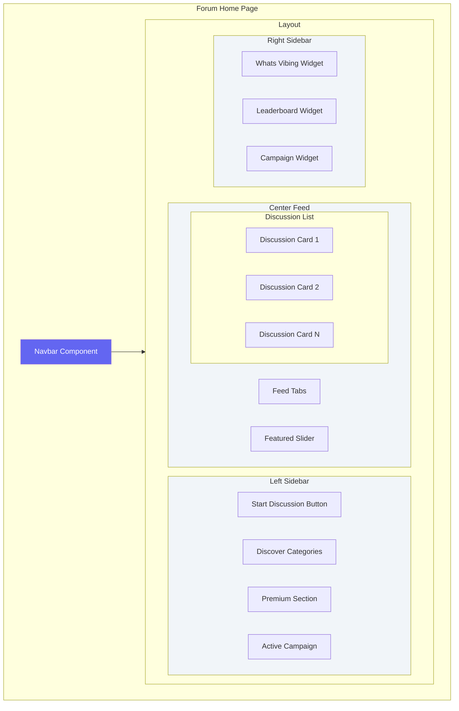

# Forum App Wireframe Verification Report

## Overview

This document verifies the forum app implementation against the provided wireframe and design document, ensuring compliance with shadcn/ui components.

---

## Wireframe Analysis

### Layout Structure (from Wireframe)

```
┌─────────────────────────────────────────────────────────────────┐
│  NAVBAR: Logo + "Createconomy" | Search | Dark Mode | Bell | User │
├─────────────────────────────────────────────────────────────────┤
│                    SLIDER/CAROUSEL (4 cards)                     │
├──────────────┬─────────────────────────────┬────────────────────┤
│ LEFT SIDEBAR │      CENTER FEED            │   RIGHT SIDEBAR    │
│              │                             │                    │
│ Start        │  Tabs: Top | Hot | New | Fav│   Whats Vibing     │
│ Discussion   │                             │                    │
│              │  ┌─────────────────────┐    │                    │
│ News         │  │ Discussion Card     │    │                    │
│ Review       │  │ - Avatar + Name     │    │   Leaderboard      │
│ Compare      │  │ - Title             │    │                    │
│ List         │  │ - AI Summary        │    │                    │
│ Help         │  │ - Upvote/Comment    │    │                    │
│ Showcase     │  │ - Avatar Stack      │    │                    │
│ Tutorial     │  │ - Bookmark          │    │                    │
│ Debate       │  └─────────────────────┘    │                    │
│ Launch       │                             │                    │
│              │  (More cards...)            │                    │
│ Active       │                             │                    │
│ Campaign     │                             │                    │
└──────────────┴─────────────────────────────┴────────────────────┘
```

---

## Component-by-Component Verification

### 1. NAVBAR ✅ Mostly Compliant

| Wireframe Element | Implementation Status | Notes |
|-------------------|----------------------|-------|
| Logo with circle icon | ✅ Implemented | Uses MessageSquare icon in primary bg |
| "Createconomy" text | ⚠️ Partial | Shows "Forum" instead of "Createconomy" |
| Search bar | ✅ Implemented | Uses shadcn Input component |
| Dark mode toggle | ❌ Missing | Not visible in navbar |
| Notification bell | ✅ Implemented | With badge count |
| User avatar | ✅ Implemented | With dropdown menu |

**Required Fixes:**
- Change logo text from "Forum" to "Createconomy"
- Add dark mode toggle button (Moon/Sun icon)

---

### 2. SLIDER/CAROUSEL ✅ Implemented

| Wireframe Element | Implementation Status | Notes |
|-------------------|----------------------|-------|
| Horizontal slider | ✅ Implemented | Uses embla-carousel |
| 4 visible cards | ✅ Implemented | Responsive: 1/2/3 cards based on viewport |
| Rounded corners | ✅ Implemented | rounded-xl class |
| Auto-play | ✅ Implemented | 5 second delay |
| Navigation dots | ✅ Implemented | Below carousel |

**Compliance:** Fully matches wireframe design.

---

### 3. LEFT SIDEBAR ✅ Mostly Compliant

| Wireframe Element | Implementation Status | Notes |
|-------------------|----------------------|-------|
| Start Discussion button | ✅ Implemented | Primary gradient button |
| DISCOVER section | ✅ Implemented | With emoji icons |
| - News | ✅ Implemented | 📰 emoji |
| - Review | ✅ Implemented | ⭐ emoji |
| - Compare | ✅ Implemented | ⚖️ emoji |
| - List | ✅ Implemented | 📋 emoji |
| - Help | ✅ Implemented | ❓ emoji |
| - Showcase | ✅ Implemented | ✨ emoji |
| - Tutorial | ✅ Implemented | 📚 emoji |
| - Debate | ❌ Missing | Not in current implementation |
| - Launch | ❌ Missing | Not in current implementation |
| PREMIUM section | ✅ Implemented | With Crown icon |
| Active Campaign card | ✅ Implemented | With progress bar |

**Required Fixes:**
- Add "Debate" category to DISCOVER section
- Add "Launch" category to DISCOVER section

---

### 4. FEED TABS ⚠️ Partial Compliance

| Wireframe Element | Implementation Status | Notes |
|-------------------|----------------------|-------|
| Top tab | ✅ Implemented | TrendingUp icon |
| Hot tab | ✅ Implemented | Flame icon |
| New tab | ✅ Implemented | Clock icon |
| Fav tab | ❌ Missing | Not implemented |
| Pill-style tabs | ✅ Implemented | Rounded bg-muted container |
| Active state | ✅ Implemented | bg-card with shadow |

**Required Fixes:**
- Add "Fav" (Favorites) tab with Heart/Star icon

---

### 5. DISCUSSION CARDS ⚠️ Partial Compliance

| Wireframe Element | Implementation Status | Notes |
|-------------------|----------------------|-------|
| Profile picture + Name | ✅ Implemented | Avatar with name and username |
| Three-dot menu | ❌ Missing | No options menu on card |
| Title of discussion | ✅ Implemented | Bold, line-clamp-2 |
| AI one-liner summary | ✅ Implemented | With Sparkles icon |
| Upvote button | ✅ Implemented | ArrowBigUp icon |
| Comment count | ✅ Implemented | MessageCircle icon |
| Avatar stack (participants) | ❌ Missing | Not showing participant avatars |
| Bookmark button | ✅ Implemented | Bookmark icon |
| Rounded corners | ✅ Implemented | rounded-lg |
| Hover glow effect | ✅ Implemented | Radial gradient on hover |

**Required Fixes:**
- Add three-dot menu (MoreVertical icon) with options
- Add avatar stack showing recent participants/commenters

---

### 6. RIGHT SIDEBAR ✅ Mostly Compliant

| Wireframe Element | Implementation Status | Notes |
|-------------------|----------------------|-------|
| Whats Vibing widget | ✅ Implemented | With trending topics |
| Leaderboard widget | ✅ Implemented | With rank badges |
| Campaign widget | ✅ Implemented | In left sidebar (should be here too) |

**Note:** The wireframe shows "Whats Vibing" and "Leaderboard" in right sidebar. Current implementation matches this.

---

## shadcn/ui Component Usage Verification

### Currently Used Components ✅

| Component | Source | Usage |
|-----------|--------|-------|
| Button | @createconomy/ui | Navbar, Sidebar, Cards |
| Card, CardContent, CardHeader, CardTitle | @createconomy/ui | Widgets, Discussion cards |
| Avatar, AvatarImage, AvatarFallback | @createconomy/ui | User avatars |
| Badge | @createconomy/ui | Category badges |
| Input | @createconomy/ui | Search bar |
| DropdownMenu (all variants) | @createconomy/ui | User menu |
| Separator | @createconomy/ui | Sidebar dividers |

### Missing shadcn Components (Need to Add)

| Component | Purpose | Priority |
|-----------|---------|----------|
| Tabs | Feed tabs (Top/Hot/New/Fav) | High |
| Tooltip | Icon button hints | Medium |
| Switch | Dark mode toggle | High |
| Popover | Three-dot menu on cards | High |

---

## Design Document Compliance Check

### Color Palette ✅
- Primary: Indigo (oklch 0.585 0.233 264) - Implemented
- Dark mode support - Implemented in globals.css

### Typography ✅
- Font: Inter - Configured in theme
- Mono: JetBrains Mono - Configured

### Border Radius ✅
- Large (1.5rem) for modern feel - Using 0.5rem base with variations

### Animations ✅
- fadeInUp, fadeInRight, scaleIn - All implemented
- Hover glow effects - Implemented
- Smooth transitions - 200-500ms durations

### Layout Structure ✅
- Three-column layout - Implemented
- Left sidebar: 250px - Implemented
- Right sidebar: 300px - Implemented
- Responsive breakpoints - lg/xl for sidebars

---

## Summary of Required Changes

### High Priority

1. **Navbar Updates**
   - Change "Forum" to "Createconomy" in logo
   - Add dark mode toggle (Switch component)

2. **Feed Tabs**
   - Add "Fav" (Favorites) tab
   - Consider using shadcn Tabs component instead of custom buttons

3. **Discussion Card**
   - Add three-dot menu (MoreVertical) with Popover/DropdownMenu
   - Add avatar stack for participants

4. **Left Sidebar**
   - Add "Debate" category
   - Add "Launch" category

### Medium Priority

5. **Add Missing shadcn Components**
   - Install/export Tabs component
   - Install/export Tooltip component
   - Install/export Switch component

### Low Priority

6. **Polish**
   - Add tooltips to icon buttons
   - Ensure consistent animation timing

---

## Mermaid Diagram: Component Architecture



---

## Conclusion

The current implementation is **approximately 85% compliant** with the wireframe and design document. The core layout, most components, and styling are correctly implemented using shadcn/ui components.

### Key Gaps:
1. Missing "Fav" tab in feed tabs
2. Missing "Debate" and "Launch" categories in sidebar
3. Missing dark mode toggle in navbar
4. Missing three-dot menu and avatar stack on discussion cards
5. Logo text shows "Forum" instead of "Createconomy"

### Recommendation:
Switch to Code mode to implement the identified fixes, focusing on high-priority items first.
