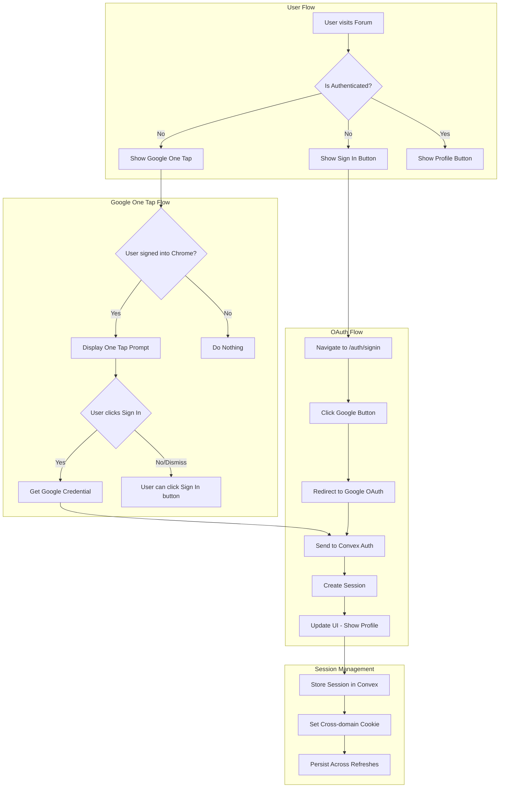
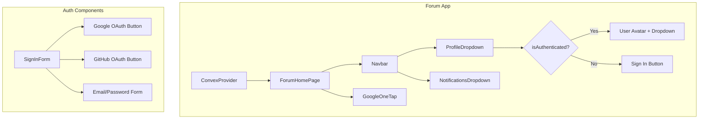

# Google One Tap Authentication Implementation Plan

## Overview

This plan outlines the implementation of Google One Tap sign-in functionality for the Createconomy Forum application. The feature will provide seamless authentication for users who are already signed into Chrome with their Google account.

## Current State Analysis

### Existing Infrastructure

1. **Convex Auth Setup** - [`packages/convex/convex/auth.ts`](packages/convex/convex/auth.ts:21)
   - Google OAuth provider already configured with `@auth/core/providers/google`
   - Session management with cross-subdomain support
   - Helper functions for authentication state

2. **Auth Hook** - [`apps/forum/src/hooks/use-auth.ts`](apps/forum/src/hooks/use-auth.ts:16)
   - `useAuth()` hook provides `isLoading`, `isAuthenticated`, `user`, `signInWithGoogle()`, `signOut()`
   - Uses `useConvexAuth()` and `useAuthActions()` from Convex Auth

3. **Profile Dropdown** - [`apps/forum/src/components/navbar/profile-dropdown.tsx`](apps/forum/src/components/navbar/profile-dropdown.tsx:9)
   - Currently uses mock auth state (hardcoded `isAuthenticated: false`)
   - Needs to be updated to use real `useAuth()` hook

4. **Navbar** - [`apps/forum/src/components/navbar/navbar.tsx`](apps/forum/src/components/navbar/navbar.tsx:78)
   - Uses `isLoggedIn` prop with default `true`
   - Has internal `UserMenu` component with hardcoded user data

5. **Sign-in Form** - [`apps/forum/src/components/auth/sign-in-form.tsx`](apps/forum/src/components/auth/sign-in-form.tsx:106)
   - Has Google/GitHub buttons but they are not connected to actual OAuth flow

6. **Convex Provider** - [`apps/forum/src/providers/convex-provider.tsx`](apps/forum/src/providers/convex-provider.tsx:29)
   - Properly configured with `ConvexAuthProvider`

---

## Implementation Phases

### Phase 1: Update ProfileDropdown to Use Real Auth State

**File:** [`apps/forum/src/components/navbar/profile-dropdown.tsx`](apps/forum/src/components/navbar/profile-dropdown.tsx)

**Changes:**
- Remove mock `useAuth` function
- Import real `useAuth` from `@/hooks/use-auth`
- Add loading state handling
- Display user profile picture and name from Google OAuth

```typescript
// Before
const useAuth = () => {
  return {
    user: null as { name: string; username: string; avatarUrl: string } | null,
    isAuthenticated: false,
  };
};

// After
import { useAuth } from '@/hooks/use-auth';
```

**UI Updates:**
- Show skeleton loader during auth check
- Display Google profile picture when authenticated
- Show Sign In button when not authenticated

---

### Phase 2: Create GoogleOneTap Component

**New File:** `apps/forum/src/components/auth/google-one-tap.tsx`

**Purpose:** Implement Google One Tap sign-in that automatically detects Chrome Google account

**Key Features:**
1. Load Google Identity Services SDK
2. Initialize One Tap with client ID
3. Handle credential response
4. Integrate with Convex Auth `signInWithGoogle()`
5. Position prompt near Sign In button
6. Auto-dismiss when user is already authenticated

**Implementation Details:**

```typescript
interface GoogleOneTapProps {
  onSuccess?: () => void;
  onError?: (error: string) => void;
  promptParentId?: string; // For positioning near Sign In button
}
```

**SDK Integration:**
- Use `google.accounts.id.initialize()` with client ID
- Use `google.accounts.id.prompt()` to show One Tap UI
- Handle `credential` response and pass to Convex Auth

**Fallback Behavior:**
- If One Tap is not available (user not signed into Chrome), do nothing
- User can still click Sign In button to go to sign-in page

---

### Phase 3: Update Sign-in Form with Working OAuth

**File:** [`apps/forum/src/components/auth/sign-in-form.tsx`](apps/forum/src/components/auth/sign-in-form.tsx)

**Changes:**
- Connect Google button to `signInWithGoogle()` from `useAuth()`
- Connect GitHub button to `signInWithGitHub()` from `useAuth()`
- Add loading states for OAuth buttons
- Handle OAuth errors

```typescript
const { signInWithGoogle, signInWithGitHub, isLoading } = useAuth();

const handleGoogleSignIn = async () => {
  try {
    await signInWithGoogle();
    router.push(callbackUrl);
  } catch (err) {
    setError(err instanceof Error ? err.message : 'Google sign-in failed');
  }
};
```

---

### Phase 4: Integrate GoogleOneTap into Forum Landing Page

**File:** [`apps/forum/src/app/page.tsx`](apps/forum/src/app/page.tsx)

**Changes:**
- Import and render `GoogleOneTap` component
- Only show when user is not authenticated
- Position near the navbar Sign In button area

```typescript
import { GoogleOneTap } from '@/components/auth/google-one-tap';
import { useAuth } from '@/hooks/use-auth';

export default function ForumHomePage() {
  const { isAuthenticated, isLoading } = useAuth();
  
  return (
    <div>
      {!isAuthenticated && !isLoading && (
        <GoogleOneTap 
          onSuccess={() => console.log('Signed in!')}
          onError={(err) => console.error(err)}
        />
      )}
      {/* ... rest of page */}
    </div>
  );
}
```

---

### Phase 5: Add Loading States and Error Handling

**Components to Update:**

1. **ProfileDropdown** - Show skeleton during auth check
2. **Navbar** - Pass real auth state instead of prop
3. **GoogleOneTap** - Handle SDK load failures gracefully

**Loading State UI:**
```typescript
if (isLoading) {
  return (
    <div className="w-10 h-10 rounded-full bg-muted animate-pulse" />
  );
}
```

**Error Handling:**
- Toast notifications for failed sign-in attempts
- Graceful fallback when Google SDK fails to load
- Clear error messages for users

---

### Phase 6: Update Navbar Component

**File:** [`apps/forum/src/components/navbar/navbar.tsx`](apps/forum/src/components/navbar/navbar.tsx)

**Changes:**
- Remove `isLoggedIn` prop (use real auth state)
- Import `useAuth` hook
- Update `UserMenu` to use real user data
- Add sign out functionality

```typescript
import { useAuth } from '@/hooks/use-auth';

export function Navbar({ onMobileMenuToggle, isMobileMenuOpen }: NavbarProps) {
  const { user, isAuthenticated, isLoading, signOut } = useAuth();
  
  // ... rest of component
}
```

**UserMenu Updates:**
- Display actual user name and avatar from Google profile
- Connect Sign Out button to `signOut()` function
- Show user email in dropdown

---

### Phase 7: Environment Configuration

**Required Environment Variables:**

```env
# Google OAuth (already configured in Convex)
AUTH_GOOGLE_ID=your-google-client-id
AUTH_GOOGLE_SECRET=your-google-client-secret

# For Google One Tap (client-side)
NEXT_PUBLIC_GOOGLE_CLIENT_ID=your-google-client-id
```

**Google Cloud Console Setup:**
1. Enable Google Identity Services API
2. Configure OAuth consent screen
3. Add authorized JavaScript origins for One Tap
4. Add authorized redirect URIs for OAuth flow

---

## Architecture Diagram



---

## Component Hierarchy



---

## File Changes Summary

| File | Action | Description |
|------|--------|-------------|
| `apps/forum/src/components/auth/google-one-tap.tsx` | Create | New Google One Tap component |
| `apps/forum/src/components/navbar/profile-dropdown.tsx` | Modify | Use real auth state |
| `apps/forum/src/components/navbar/navbar.tsx` | Modify | Use real auth state, remove mock data |
| `apps/forum/src/components/auth/sign-in-form.tsx` | Modify | Connect OAuth buttons |
| `apps/forum/src/app/page.tsx` | Modify | Add GoogleOneTap component |
| `apps/forum/src/hooks/use-auth.ts` | Modify | Add username field mapping |
| `apps/forum/.env.example` | Modify | Add NEXT_PUBLIC_GOOGLE_CLIENT_ID |

---

## Testing Checklist

- [ ] User not signed into Chrome - One Tap does not appear, Sign In button works
- [ ] User signed into Chrome - One Tap appears automatically
- [ ] User clicks One Tap - Signs in successfully, UI updates
- [ ] User dismisses One Tap - Can still use Sign In button
- [ ] User clicks Sign In button - Navigates to sign-in page
- [ ] User clicks Google button on sign-in page - OAuth flow works
- [ ] After sign-in - Profile button shows with Google avatar
- [ ] Profile dropdown - Shows user name, email, settings, logout
- [ ] Logout - Clears session, shows Sign In button again
- [ ] Page refresh - Session persists, user stays logged in
- [ ] Cross-tab - Session syncs across browser tabs

---

## Security Considerations

1. **CSRF Protection** - Convex Auth handles CSRF tokens
2. **Session Security** - HttpOnly cookies, secure flag in production
3. **Token Validation** - Server-side validation of Google credentials
4. **Cross-Origin** - Proper CORS configuration for subdomains

---

## Dependencies

No new dependencies required. Using:
- `@convex-dev/auth` - Already installed
- `@auth/core/providers/google` - Already configured
- Google Identity Services SDK - Loaded via script tag

---

## Rollback Plan

If issues arise:
1. Remove `GoogleOneTap` component from page
2. Revert `ProfileDropdown` to show Sign In button only
3. Keep OAuth flow on sign-in page as fallback
