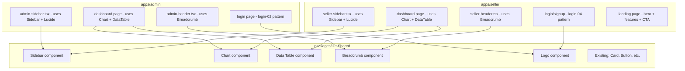

# Landing Page Redesign — Admin & Seller Apps

## Summary

Modernize both `apps/admin` and `apps/seller` using official shadcn/ui blocks and free open-source components, replacing the current custom layout/chart/table implementations with proper shadcn Sidebar, Chart, and Data Table components. Add a new seller onboarding landing page using free 21st.dev hero/feature sections.

## Current State

Both apps have:
- Custom sidebars with emoji/inline-SVG icons (not using shadcn Sidebar)
- Custom headers with manual dropdown menus
- Raw recharts usage (not using shadcn Chart wrapper)
- Plain HTML tables (not using shadcn Data Table)
- No `components.json` — shadcn CLI not initialized
- Hardcoded `var()` CSS instead of Tailwind utility classes

## Logo

Dark geometric "C" mark — monochrome, works with dark mode. Will be integrated into sidebar headers and login cover panels across both apps.

## Phase Plan

| Phase | File | Scope |
|-------|------|-------|
| 01 | [phase-01-foundation.md](./phase-01-foundation.md) | shadcn init, shared components, logo setup |
| 02 | [phase-02-admin-layout.md](./phase-02-admin-layout.md) | Admin sidebar, header, layout replacement |
| 03 | [phase-03-admin-dashboard.md](./phase-03-admin-dashboard.md) | Admin dashboard page with charts + data table |
| 04 | [phase-04-admin-auth.md](./phase-04-admin-auth.md) | Admin login page redesign |
| 05 | [phase-05-seller-layout.md](./phase-05-seller-layout.md) | Seller sidebar, header, layout replacement |
| 06 | [phase-06-seller-dashboard.md](./phase-06-seller-dashboard.md) | Seller dashboard page with charts + data table |
| 07 | [phase-07-seller-auth.md](./phase-07-seller-auth.md) | Seller login/signup redesign |
| 08 | [phase-08-seller-landing.md](./phase-08-seller-landing.md) | New seller onboarding landing page |

## Architecture

## Free Resources Used

| Resource | Components Taken | License |
|----------|-----------------|---------|
| shadcn/ui | Sidebar, Chart, Data Table, Login/Signup blocks | MIT |
| Lucide Icons | All nav icons | ISC |
| 21st.dev | Hero, Features, CTA sections for seller landing | MIT |
| Origin UI | Stats card patterns | MIT |

## Key Decisions

1. **Components go in `packages/ui`** — Sidebar, Chart, Breadcrumb added to shared package so both apps reuse them
2. **Blocks are adapted per-app** — Login/dashboard layouts are copy-pasted from shadcn blocks then customized per app
3. **No `components.json` needed in apps** — Since we use `packages/ui` as the shared component source, components install there
4. **Recharts stays** — shadcn Chart wraps recharts, so no dependency change needed
5. **Logo as SVG component** — Created once in `packages/ui`, imported everywhere
