# Marketplace App — Missing Pages & Backend Integration Plan

## Summary

Deep analysis of the marketplace app (`apps/marketplace`) reveals **two major categories of gaps**:

### A. Missing Pages (13 pages that don't exist but should)

Pages referenced in navigation, footer links, or the product detail page that have no corresponding route files:

| # | Missing Page | Referenced From | Priority |
|---|-------------|----------------|----------|
| 1 | `/sellers/[id]` — Seller profile/storefront | Product detail page link | 🔴 High |
| 2 | `/search` — Dedicated search results page | Header search form (partial via `/products?search=`) | 🟡 Medium |
| 3 | `/account/reviews` — User's reviews page | Account dashboard links to reviews stat | 🟡 Medium |
| 4 | `/account/wishlist` — Wishlist/favorites page | Account dashboard links to wishlist stat, heart button on product | 🟡 Medium |
| 5 | `/about` — About page | Footer link | 🟢 Low |
| 6 | `/blog` — Blog page | Footer link | 🟢 Low |
| 7 | `/careers` — Careers page | Footer link | 🟢 Low |
| 8 | `/contact` — Contact page | Footer link | 🟡 Medium |
| 9 | `/terms` — Terms of Service | Footer link | 🟡 Medium |
| 10 | `/privacy` — Privacy Policy | Footer link | 🟡 Medium |
| 11 | `/refunds` — Refund Policy | Footer link | 🟡 Medium |
| 12 | `/support` — Support/Help page | Checkout success page link | 🟡 Medium |
| 13 | `/account/downloads` — Digital downloads page | Missing but needed for digital product delivery | 🟡 Medium |

### B. Pages With Mock Data Instead of Backend Integration (8 pages)

These pages exist but use hardcoded mock data instead of querying the Convex backend:

| # | Page | Issue | Backend Functions Available |
|---|------|-------|---------------------------|
| 1 | `/products/[slug]` | Mock `getProduct()` with hardcoded data | `api.functions.products.getProductBySlug` |
| 2 | `/products` (ProductGrid) | Mock `getProducts()` in component | `api.functions.products.listProducts`, `searchProducts` |
| 3 | `/products` (ProductFilters) | Hardcoded category list | `api.functions.categories.listCategories` |
| 4 | `/categories` | Mock categories array | `api.functions.categories.listCategories` |
| 5 | `/categories/[slug]` | Mock `getCategory()` function | `api.functions.categories.getCategoryBySlug` |
| 6 | `/account` | Mock user data, stats | `api.functions.users.getCurrentUser`, `orders.getUserOrders` |
| 7 | `/account/orders` | Mock orders array | `api.functions.orders.getUserOrders` |
| 8 | `/account/orders/[id]` | Mock `getOrder()` function | `api.functions.orders.getOrder` |
| 9 | `/account/settings` | Mock user data, no form submission | `api.functions.users.getCurrentUser`, `updateUserProfile` |
| 10 | `/cart` | Static empty array, not using Convex cart | `api.functions.cart.*` (cart functions available) |
| 11 | Product reviews tab | Placeholder text instead of reviews | `api.functions.reviews.getProductReviews`, `getProductReviewStats` |

### C. Components Missing Backend Integration

| Component | Issue |
|-----------|-------|
| `product-grid.tsx` | Uses mock data instead of Convex queries |
| `product-filters.tsx` | Hardcoded categories, should fetch from backend |
| `cart-item.tsx` / `cart-summary.tsx` | Uses Zustand local store, not synced with Convex cart |
| `add-to-cart-button.tsx` | Uses local Zustand store |
| `checkout/page.tsx` | Reads from localStorage, not Convex cart |

---

## Phase Plan

| Phase | File | Description |
|-------|------|-------------|
| [Phase 01](./phase-01-backend-integration-products.md) | Products & Categories Backend Integration | Replace mock data in product listing, detail, filters, and categories pages |
| [Phase 02](./phase-02-backend-integration-account.md) | Account Pages Backend Integration | Replace mock data in account dashboard, orders, settings |
| [Phase 03](./phase-03-cart-checkout-integration.md) | Cart & Checkout Backend Integration | Connect cart to Convex, fix checkout flow |
| [Phase 04](./phase-04-reviews-integration.md) | Reviews System Integration | Add review display, creation, and stats on product pages |
| [Phase 05](./phase-05-missing-pages-seller-search.md) | Seller Profile & Search Pages | Create seller storefront page and dedicated search page |
| [Phase 06](./phase-06-missing-pages-account.md) | Account Sub-Pages | Create reviews, wishlist, and downloads account pages |
| [Phase 07](./phase-07-missing-pages-static.md) | Static & Policy Pages | Create about, contact, terms, privacy, refunds, support pages |

---

## Architecture Diagram

```mermaid
graph TD
    subgraph Marketplace App
        HP[Home Page]
        PP[Products Page]
        PDP[Product Detail Page]
        CP[Categories Page]
        CDP[Category Detail Page]
        SP[Seller Profile Page - MISSING]
        SRP[Search Results Page - MISSING]
        CART[Cart Page]
        CO[Checkout Page]
        COS[Checkout Success]
        COC[Checkout Cancel]
        AD[Account Dashboard]
        AO[Account Orders]
        AOD[Account Order Detail]
        AS[Account Settings]
        AR[Account Reviews - MISSING]
        AW[Account Wishlist - MISSING]
        ADL[Account Downloads - MISSING]
        ABT[About - MISSING]
        CON[Contact - MISSING]
        TOS[Terms - MISSING]
        PRV[Privacy - MISSING]
        REF[Refunds - MISSING]
        SUP[Support - MISSING]
    end

    subgraph Convex Backend
        PF[products functions]
        CF[categories functions]
        OF[orders functions]
        RF[reviews functions]
        UF[users functions]
        CARTF[cart functions]
        SF[stripe functions]
    end

    PP -.->|MOCK DATA| PF
    PDP -.->|MOCK DATA| PF
    CP -.->|MOCK DATA| CF
    CDP -.->|MOCK DATA| CF
    AD -.->|MOCK DATA| UF
    AO -.->|MOCK DATA| OF
    AOD -.->|MOCK DATA| OF
    CART -.->|LOCAL STORE| CARTF
    CO -.->|localStorage| SF

    style SP fill:#ff6b6b,color:#fff
    style SRP fill:#ff6b6b,color:#fff
    style AR fill:#ff6b6b,color:#fff
    style AW fill:#ff6b6b,color:#fff
    style ADL fill:#ff6b6b,color:#fff
    style ABT fill:#ff6b6b,color:#fff
    style CON fill:#ff6b6b,color:#fff
    style TOS fill:#ff6b6b,color:#fff
    style PRV fill:#ff6b6b,color:#fff
    style REF fill:#ff6b6b,color:#fff
    style SUP fill:#ff6b6b,color:#fff
```

> Red nodes = missing pages. Dashed arrows = mock data instead of real backend calls.
