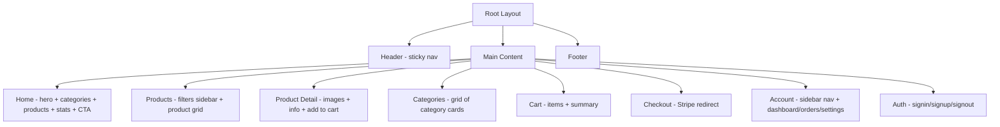

# Marketplace App Modernization — Overview

> Modernize `apps/marketplace` to match the shadcn component quality established in the admin and seller apps.

## Current State Assessment

The marketplace app (`apps/marketplace`, port 3000) is the main consumer-facing storefront. While it uses some `@createconomy/ui` components (`Button`, `Card`, `Input`, `Skeleton`), it has significant gaps:

### Issues Found

| Issue | Count | Files Affected |
|-------|-------|----------------|
| Inline SVG icon functions | 15+ | Every component file |
| No Logo component usage | — | header.tsx, footer.tsx |
| Custom dropdown (useState) | 1 | user-menu.tsx |
| Raw HTML instead of shadcn | 3 | cart-summary, checkout, account |
| AuthPageWrapper (old pattern) | 2 | signin, signup |
| No `lucide-react` dependency | — | package.json |
| No mobile navigation | — | header.tsx |
| Basic hero section | — | page.tsx |

### What Already Works

- shadcn `Button`, `Card`, `CardContent`, `Input`, `Label`, `Skeleton` are imported from `@createconomy/ui`
- Product cards have good hover effects and image scaling
- SEO metadata is thorough
- Stripe checkout flow is functional
- Product JSON-LD structured data exists

## Architecture

The marketplace is a **public storefront** (not a dashboard app), so it does NOT use the Sidebar pattern. Instead it has:
- **Sticky header** with logo, navigation, search, user menu
- **Footer** with 4-column link grid
- **Content pages** using `container` class

## Phase Plan

| Phase | Name | Focus |
|-------|------|-------|
| [01](phase-01-foundation.md) | Foundation + Icons | Add lucide-react, replace ALL inline SVGs across entire app |
| [02](phase-02-header-footer.md) | Header + Footer | Logo component, shadcn DropdownMenu user menu, mobile nav Sheet, Lucide social icons |
| [03](phase-03-home-hero.md) | Home Page Hero | Enhanced hero with animated text or gradient, improved stats bar, refined category/product cards |
| [04](phase-04-products.md) | Products + Product Detail | Product card with Lucide icons, product filters with shadcn Select/Checkbox, product detail with Badge/Tabs |
| [05](phase-05-cart-checkout.md) | Cart + Checkout | shadcn Card for cart summary, Lucide icons for cart actions, checkout states with shadcn components |
| [06](phase-06-account.md) | Account Pages | Account layout with proper active NavLink, orders with shadcn Table/Badge, settings with shadcn form |
| [07](phase-07-auth.md) | Auth Pages | Two-column login-02 pattern matching admin/seller, consistent branding |

## Shared Components Already Available

From `packages/ui` (added in admin/seller phases):
- `Logo`, `LogoWithText` — geometric C mark
- `Sidebar` family — NOT needed for marketplace
- `Chart`, `ChartContainer` — NOT needed for marketplace
- `Breadcrumb` — useful for product detail
- `Card`, `Button`, `Input`, `Badge`, `Table`, `Avatar`, `Separator`
- `DropdownMenu`, `Select`, `Checkbox`, `Tabs` — available in packages/ui

## Key Principle

The marketplace is a **consumer-facing storefront**, not an admin dashboard. Design choices should prioritize:
- Clean, modern aesthetics with generous whitespace
- Fast perceived performance (skeleton loading, image optimization)
- Mobile-first responsive design
- Trust signals (security badges, reviews, ratings)
- Conversion optimization (clear CTAs, streamlined checkout)
