# Mock Data Removal & App Integration Plan

## Summary

This plan addresses three critical issues across the Createconomy monorepo:

1. **Mock data removal** — Admin and Seller apps contain extensive hardcoded/mock data instead of querying Convex backend
2. **Google login fix** — Admin uses `useAuthActions` directly (different pattern); Seller has correct `useAuth` hook but needs testing/verification
3. **Feature gap analysis** — Admin and Seller apps lack backend integration for pages that already have Convex API functions available

## Current State Assessment

### Mock Data Status by App

| App | Mock Data Files | Backend-Integrated Files | Status |
|-----|----------------|------------------------|--------|
| **Forum** | 0 | All pages use `useQuery`/`useMutation` | ✅ Fully integrated |
| **Marketplace** | 0 (only in tests) | All pages use Convex hooks | ✅ Fully integrated |
| **Admin** | ~15 pages with hardcoded data | Only 3 moderation pages use Convex | ❌ Mostly mock |
| **Seller** | ~8 pages with hardcoded data | 4 pages use Convex (affiliates, discounts, posts, webhooks) | ⚠️ Partially integrated |

### Google Login Status by App

| App | Sign-In Method | Google Login | Status |
|-----|---------------|-------------|--------|
| **Forum** | `SharedSignInForm` + `useAuth` hook | `convexSignIn("google", { redirectTo: siteUrl })` | ✅ Working |
| **Marketplace** | `SharedSignInForm` + `useAuth` hook | `convexSignIn("google", { redirectTo: siteUrl })` | ✅ Working |
| **Admin** | `AdminSignInForm` + `useAuthActions` directly | `signIn("google", { redirectTo: "/" })` | ⚠️ Different pattern - redirects to `/` not site URL |
| **Seller** | `SharedSignInForm` + `useAuth` hook | `convexSignIn("google", { redirectTo: siteUrl })` | ⚠️ Has correct pattern, needs `NEXT_PUBLIC_SITE_URL` env var |

### Feature Integration Gap

**Admin App — Pages using mock data instead of Convex:**
- Dashboard (`page.tsx`) — hardcoded stats cards (`$45,231.89`, `2,350`, etc.)
- `revenue-chart.tsx` — hardcoded monthly data
- `recent-orders.tsx` — hardcoded 5 fake orders
- `users/page.tsx` — hardcoded 4 fake users
- `orders/page.tsx` — hardcoded 5 fake orders + stats
- `orders/[id]/page.tsx` — hardcoded single order
- `products/page.tsx` — hardcoded 4 fake products
- `products/[id]/page.tsx` — hardcoded single product
- `sellers/page.tsx` — hardcoded 4 fake sellers + stats
- `sellers/[id]/page.tsx` — hardcoded single seller
- `sellers/pending/page.tsx` — hardcoded 3 pending applications
- `categories/page.tsx` — hardcoded categories
- `categories/[id]/page.tsx` — hardcoded single category
- `users/[id]/page.tsx` — hardcoded single user
- `analytics/page.tsx` — all analytics data hardcoded
- `moderation/reviews/page.tsx` — hardcoded pending reviews

**Seller App — Pages using mock data instead of Convex:**
- Dashboard (`dashboard/page.tsx`) — hardcoded stats (`$12,450.00`, `156`, etc.)
- `revenue-chart.tsx` — hardcoded monthly data
- `recent-orders.tsx` — hardcoded 5 fake orders
- `low-stock-alert.tsx` — hardcoded 4 low-stock products
- `products/page.tsx` — hardcoded 4 fake products
- `products/[id]/page.tsx` — hardcoded single product
- `products/[id]/images/page.tsx` — hardcoded 3 images
- `orders/page.tsx` — hardcoded 6 fake orders
- `orders/[id]/page.tsx` — hardcoded single order
- `reviews/page.tsx` — hardcoded 5 fake reviews
- `reviews/[id]/page.tsx` — hardcoded single review
- `analytics/page.tsx` — all analytics data hardcoded

**Available Convex Backend Functions (already exist but not wired up):**
- `admin.getDashboardStats` — real stats
- `admin.listAllUsers` — paginated users
- `admin.listAllOrders` — paginated orders
- `admin.listPendingSellers` — pending applications
- `admin.approveSeller` — approve/reject
- `admin.listPendingReviews` — reviews for moderation
- `admin.moderateReview` — approve/reject reviews
- `admin.forceUpdateOrderStatus` — admin order status change
- `admin.changeUserRole` — change user role
- `admin.updateUserStatus` — ban/unban
- `orders.*` — order queries
- `products.*` — product queries
- `categories.*` — category queries
- `reviews.*` — review queries

## Phase Files

| Phase | File | Description |
|-------|------|-------------|
| 01 | [phase-01-admin-mock-removal.md](./phase-01-admin-mock-removal.md) | Remove all mock data from admin app, wire up Convex queries |
| 02 | [phase-02-seller-mock-removal.md](./phase-02-seller-mock-removal.md) | Remove all mock data from seller app, wire up Convex queries |
| 03 | [phase-03-google-login-fix.md](./phase-03-google-login-fix.md) | Fix Google login for admin and seller apps |
| 04 | [phase-04-feature-parity.md](./phase-04-feature-parity.md) | Close remaining feature gaps in admin/seller |

## Architecture Diagram

```mermaid
graph TB
    subgraph Frontend Apps
        M[Marketplace :3000]
        F[Forum :3001]
        A[Admin :3002]
        S[Seller :3003]
    end

    subgraph Shared Auth
        AUTH[Convex Auth Provider]
        GOOGLE[Google OAuth]
        GITHUB[GitHub OAuth]
    end

    subgraph Backend - Convex
        UA[admin.ts - Dashboard, Users, Orders, Sellers, Reviews]
        UO[orders.ts - Order CRUD]
        UP[products.ts - Product CRUD]
        UC[categories.ts - Category CRUD]
        UR[reviews.ts - Review CRUD]
        UU[users.ts - User queries]
        UMOD[moderation.ts - Reports, Bans, Actions]
        UST[stripe.ts - Payments]
        UAF[affiliates.ts - Affiliate mgmt]
        UOC[offerCodes.ts - Discount codes]
        USP[sellerPosts.ts - Seller posts]
        UWH[webhookEndpoints.ts - Webhooks]
    end

    M --> AUTH
    F --> AUTH
    A -.->|needs fix| AUTH
    S -.->|needs fix| AUTH
    AUTH --> GOOGLE
    AUTH --> GITHUB

    M -->|✅ integrated| UO
    M -->|✅ integrated| UP
    F -->|✅ integrated| UMOD

    A -.->|❌ uses mock data| UA
    A -->|✅ integrated| UMOD
    A -.->|❌ uses mock data| UO
    A -.->|❌ uses mock data| UP
    A -.->|❌ uses mock data| UC

    S -.->|❌ uses mock data| UO
    S -.->|❌ uses mock data| UP
    S -->|✅ integrated| UAF
    S -->|✅ integrated| UOC
    S -->|✅ integrated| USP
    S -->|✅ integrated| UWH
```

