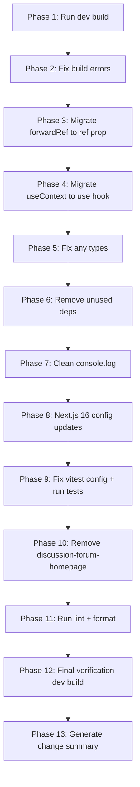

# Comprehensive QA Audit Plan — Createconomy

> **Scope**: Full codebase quality assurance pass — dev build only (per user instruction)
> **Date**: 2026-02-06
> **Target**: Zero errors, zero warnings, zero deprecated usage

---

## Overview

The Createconomy monorepo is a Turborepo workspace with:
- **4 Next.js 16 apps**: `marketplace` (port 3000), `forum` (port 3001), `admin` (port 3002), `seller` (port 3003)
- **3 shared packages**: `@createconomy/ui`, `@createconomy/convex`, `@createconomy/config`
- **1 standalone prototype**: `discussion-forum-homepage/` (v0-generated, NOT in workspace)
- **Stack**: React 19, TypeScript 5.9, Tailwind CSS 4, Convex, Stripe, Radix UI

---

## Phase 1 — Build & Compile ✅ Analysis Complete

### Findings

1. **Vitest config mismatch in marketplace**: [`vitest.config.ts`](apps/marketplace/vitest.config.ts:10) references `./src/__tests__/setup.ts` but the actual file is [`setup.tsx`](apps/marketplace/src/__tests__/setup.tsx:1) — this will cause test setup to silently fail.

2. **Next.js 16 deprecated config**:
   - [`apps/seller/next.config.ts:4`](apps/seller/next.config.ts:4) — `reactStrictMode: true` is the default in Next.js 16 and the option is deprecated. Must remove.
   - [`apps/marketplace/next.config.ts:112`](apps/marketplace/next.config.ts:112) — `experimental.serverActions` is no longer experimental in Next.js 16. Should be moved to top-level config.
   - [`apps/forum/next.config.ts:83`](apps/forum/next.config.ts:83) — Same issue with `experimental.serverActions`.

3. **`discussion-forum-homepage/`**: Standalone v0 prototype outside the workspace. Contains older dependency versions, different patterns. Should be excluded from QA scope or removed if no longer needed.

---

## Phase 2 — Deprecated Patterns

### 2A. React 19: `forwardRef` → Direct ref prop

Per AGENTS.md rule: *Don't use `forwardRef`; pass `ref` as a regular prop (React 19)*

**Files requiring migration** (23 components using `React.forwardRef`):

| File | Component(s) |
|------|-------------|
| [`packages/ui/src/components/button.tsx`](packages/ui/src/components/button.tsx:42) | `Button` |
| [`packages/ui/src/components/input.tsx`](packages/ui/src/components/input.tsx:5) | `Input` |
| [`packages/ui/src/components/card.tsx`](packages/ui/src/components/card.tsx:5) | `Card`, `CardHeader`, `CardTitle`, `CardDescription`, `CardContent`, `CardFooter` |
| [`packages/ui/src/components/avatar.tsx`](packages/ui/src/components/avatar.tsx:8) | `Avatar`, `AvatarImage`, `AvatarFallback` |
| [`packages/ui/src/components/label.tsx`](packages/ui/src/components/label.tsx:13) | `Label` |
| [`packages/ui/src/components/separator.tsx`](packages/ui/src/components/separator.tsx:8) | `Separator` |
| [`packages/ui/src/components/dropdown-menu.tsx`](packages/ui/src/components/dropdown-menu.tsx:21) | 8 sub-components |
| [`apps/forum/src/components/ui/glow-card.tsx`](apps/forum/src/components/ui/glow-card.tsx:15) | `GlowCard` |
| [`apps/forum/src/components/ui/glow-button.tsx`](apps/forum/src/components/ui/glow-button.tsx:17) | `GlowButton` |

**Note**: The `discussion-forum-homepage/` directory also has forwardRef usage but is outside the workspace scope.

### 2B. React 19: `useContext()` → `use()` hook

Per AGENTS.md rule: *Use the `use()` hook instead of `useContext()` (React 19)*

**Files requiring migration**:

| File | Hook/Function |
|------|--------------|
| [`packages/ui/src/components/auth/auth-provider.tsx:402`](packages/ui/src/components/auth/auth-provider.tsx:402) | `useAuth()` |
| [`packages/ui/src/components/security/csrf-token.tsx:41`](packages/ui/src/components/security/csrf-token.tsx:41) | `useCsrf()` |
| [`apps/admin/src/providers/theme-provider.tsx:48`](apps/admin/src/providers/theme-provider.tsx:48) | `useTheme()` |
| [`apps/forum/src/providers/theme-provider.tsx:88`](apps/forum/src/providers/theme-provider.tsx:88) | `useTheme()` |
| [`apps/marketplace/src/providers/theme-provider.tsx:84`](apps/marketplace/src/providers/theme-provider.tsx:84) | `useTheme()` |
| [`apps/seller/src/providers/theme-provider.tsx:86`](apps/seller/src/providers/theme-provider.tsx:86) | `useTheme()` |
| [`apps/forum/src/components/ui/toast.tsx:25`](apps/forum/src/components/ui/toast.tsx:25) | `useToast()` |
| [`apps/forum/src/components/navbar/glassmorphism-navbar.tsx:20`](apps/forum/src/components/navbar/glassmorphism-navbar.tsx:20) | `useMobileNav()` |

**Important**: The `use()` hook can only be used at the top level of components (same as other hooks), so the migration is straightforward: `useContext(SomeContext)` → `use(SomeContext)`.

---

## Phase 3 — Type Safety Issues

### 3A. Explicit `any` types (violates strict TypeScript)

| File | Line | Issue |
|------|------|-------|
| [`packages/convex/convex/lib/security.ts:353`](packages/convex/convex/lib/security.ts:353) | `GenericQueryCtx<any>` | Use proper DataModel generic |
| [`packages/convex/convex/functions/products.ts:817`](packages/convex/convex/functions/products.ts:817) | `(q: any)` | Type the query builder properly |
| [`packages/convex/convex/functions/forum.ts:48-49`](packages/convex/convex/functions/forum.ts:48) | `buildTree(): any`, `any[]` | Type the recursive tree structure |
| [`packages/convex/convex/functions/forum.ts:378`](packages/convex/convex/functions/forum.ts:378) | `buildTree(): any` | Same recursive tree issue |
| [`packages/convex/convex/functions/categories.ts:54-55`](packages/convex/convex/functions/categories.ts:54) | `buildTree(): any`, `any[]` | Same pattern |
| [`packages/convex/convex/functions/categories.ts:177`](packages/convex/convex/functions/categories.ts:177) | `const category: any` | Use proper Doc type |
| [`packages/convex/convex/functions/categories.ts:356`](packages/convex/convex/functions/categories.ts:356) | `const checkCategory: any` | Use proper Doc type |

---

## Phase 4 — Unused Dependencies

### 4A. Unused packages to remove

| Package | Location | Reason |
|---------|----------|--------|
| `@clerk/nextjs` | [`apps/admin/package.json:18`](apps/admin/package.json:18) | Never imported anywhere. Project uses `@convex-dev/auth`. Comment in refund route confirms Clerk was replaced. |

### 4B. `discussion-forum-homepage/` directory

This is a standalone v0-generated prototype that:
- Is NOT part of the pnpm workspace
- Has its own `pnpm-lock.yaml`, `package.json`, etc.
- Uses older versions of packages (e.g., `next@16.0.10` vs workspace `^16.1.6`)
- Contains deprecated patterns throughout
- Should be either removed or moved to a separate branch/archive

**Recommendation**: Remove it from the main branch. If needed for reference, move to a separate branch.

---

## Phase 5 — Console.log / Debug Statements

### 5A. Production code `console.log` violations

The ESLint config has `"no-console": ["warn", { allow: ["warn", "error"] }]`, so all `console.log` calls need attention.

**Seller app** — placeholder implementations with `console.log`:
| File | Line | Context |
|------|------|---------|
| [`apps/seller/src/hooks/use-seller.ts:88`](apps/seller/src/hooks/use-seller.ts:88) | Multiple | Debug logging for CRUD operations |
| [`apps/seller/src/hooks/use-auth.ts:47`](apps/seller/src/hooks/use-auth.ts:47) | 1 | Sign-out debug log |
| [`apps/seller/src/app/support/contact/page.tsx:15`](apps/seller/src/app/support/contact/page.tsx:15) | 1 | Form submit debug |
| [`apps/seller/src/app/settings/shipping/page.tsx:19`](apps/seller/src/app/settings/shipping/page.tsx:19) | 1 | Settings debug |
| [`apps/seller/src/app/settings/policies/page.tsx:20`](apps/seller/src/app/settings/policies/page.tsx:20) | 1 | Settings debug |
| [`apps/seller/src/app/settings/page.tsx:17`](apps/seller/src/app/settings/page.tsx:17) | 1 | Settings debug |
| [`apps/seller/src/app/reviews/[id]/page.tsx:36`](apps/seller/src/app/reviews/[id]/page.tsx:36) | 1 | Review response debug |
| [`apps/seller/src/app/payouts/settings/page.tsx:16`](apps/seller/src/app/payouts/settings/page.tsx:16) | 1 | Payout debug |

**Forum app**:
| File | Line | Context |
|------|------|---------|
| [`apps/forum/src/components/auth/google-one-tap.tsx`](apps/forum/src/components/auth/google-one-tap.tsx:144) | 4 | Google One Tap status logging |
| [`apps/forum/src/app/page.tsx:27`](apps/forum/src/app/page.tsx:27) | 1 | One Tap success logging |
| [`apps/forum/src/components/forum/reply-form.tsx:52`](apps/forum/src/components/forum/reply-form.tsx:52) | 1 | Reply submit debug |

**Admin app**:
| File | Line | Context |
|------|------|---------|
| [`apps/admin/src/app/api/stripe/refund/route.ts:234`](apps/admin/src/app/api/stripe/refund/route.ts:234) | 1 | Audit log via console.log |

**Convex backend** (server-side, lower priority):
| File | Count | Context |
|------|-------|---------|
| [`packages/convex/convex/http.ts:734`](packages/convex/convex/http.ts:734) | 1 | Unhandled webhook events |
| [`packages/convex/convex/functions/webhooks.ts`](packages/convex/convex/functions/webhooks.ts:81) | 6 | Missing resource logging |
| [`packages/convex/convex/functions/stripe.ts`](packages/convex/convex/functions/stripe.ts:460) | 2 | Missing resource logging |

**UI package** (documentation examples excluded):
| File | Count | Context |
|------|-------|---------|
| [`packages/ui/src/lib/error-tracking.ts`](packages/ui/src/lib/error-tracking.ts:303) | 4 | Development fallback tracker |

**Action**: Replace with `console.warn`, structured logging, or remove entirely depending on context.

---

## Phase 6 — Next.js 16 Configuration Modernization

### 6A. `experimental.serverActions` is now stable

In Next.js 16, `serverActions` has moved out of experimental. The configuration should be:

```ts
// Before (deprecated)
experimental: {
  serverActions: { bodySizeLimit: '2mb' }
}

// After (Next.js 16)
serverActions: { bodySizeLimit: '2mb' }
```

**Files**: [`apps/marketplace/next.config.ts`](apps/marketplace/next.config.ts:112), [`apps/forum/next.config.ts`](apps/forum/next.config.ts:83)

### 6B. `reactStrictMode` is default and deprecated

**File**: [`apps/seller/next.config.ts:4`](apps/seller/next.config.ts:4) — Remove `reactStrictMode: true`

### 6C. `webpack` config with `turbopack`

[`apps/marketplace/next.config.ts:126`](apps/marketplace/next.config.ts:126) has a webpack config block for tree-shaking optimization. Since Next.js 16 uses Turbopack by default, the `webpack` config block is ignored during dev. For production builds, it may still apply. This should be noted but not necessarily removed.

---

## Phase 7 — Test Configuration & Test Fixes

### 7A. Vitest setup file mismatch

[`apps/marketplace/vitest.config.ts:10`](apps/marketplace/vitest.config.ts:10) references `./src/__tests__/setup.ts` but the actual file is [`setup.tsx`](apps/marketplace/src/__tests__/setup.tsx:1).

**Fix**: Update the vitest config to reference `./src/__tests__/setup.tsx`.

### 7B. Run test suite and fix failures

Run `pnpm test` across all packages and fix any failing tests.

---

## Phase 8 — Linting & Formatting

Run `pnpm lint` and `pnpm format:check` and fix all issues.

---

## Execution Plan



---

## Files Summary by Change Type

### Config Changes
- `apps/seller/next.config.ts` — Remove `reactStrictMode`
- `apps/marketplace/next.config.ts` — Move `serverActions` out of experimental
- `apps/forum/next.config.ts` — Move `serverActions` out of experimental
- `apps/marketplace/vitest.config.ts` — Fix setup file path
- `apps/admin/package.json` — Remove `@clerk/nextjs`

### React 19 Migrations (forwardRef → ref prop)
- `packages/ui/src/components/button.tsx`
- `packages/ui/src/components/input.tsx`
- `packages/ui/src/components/card.tsx`
- `packages/ui/src/components/avatar.tsx`
- `packages/ui/src/components/label.tsx`
- `packages/ui/src/components/separator.tsx`
- `packages/ui/src/components/dropdown-menu.tsx`
- `apps/forum/src/components/ui/glow-card.tsx`
- `apps/forum/src/components/ui/glow-button.tsx`

### React 19 Migrations (useContext → use)
- `packages/ui/src/components/auth/auth-provider.tsx`
- `packages/ui/src/components/security/csrf-token.tsx`
- `apps/admin/src/providers/theme-provider.tsx`
- `apps/forum/src/providers/theme-provider.tsx`
- `apps/marketplace/src/providers/theme-provider.tsx`
- `apps/seller/src/providers/theme-provider.tsx`
- `apps/forum/src/components/ui/toast.tsx`
- `apps/forum/src/components/navbar/glassmorphism-navbar.tsx`

### Type Safety Fixes
- `packages/convex/convex/lib/security.ts`
- `packages/convex/convex/functions/products.ts`
- `packages/convex/convex/functions/forum.ts`
- `packages/convex/convex/functions/categories.ts`

### Console.log Cleanup (20+ files)
- See Phase 5 tables above

### Directory Cleanup
- `discussion-forum-homepage/` — Remove entire directory
