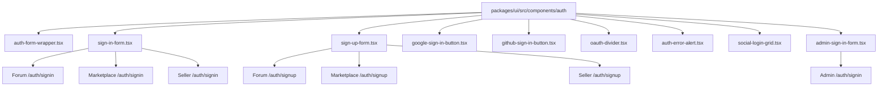

# Unified Authentication System — Plan Overview

## Objective

Standardize authentication UI across all four Createconomy applications (forum, marketplace, seller, admin) by:

1. Extracting shared auth form components into [`@createconomy/ui`](packages/ui/package.json)
2. Replicating the forum app's auth design (source of truth) into marketplace and seller apps
3. Creating a minimal Google-only sign-in page for the admin app
4. Consolidating duplicated OAuth SVG icons, validation logic, and form patterns

## Current State Summary

| App | Sign In | Sign Up | Design Style | Auth Hook | Shared UI Usage |
|-----|---------|---------|-------------|-----------|-----------------|
| **Forum** | Email/password + Google + GitHub | Username/email/password + terms + Google + GitHub | Card layout, max-w-md, centered | [`useAuth()`](apps/forum/src/hooks/use-auth.ts) via Convex | Uses `Button`, `Input`, `Label` from `@createconomy/ui` |
| **Marketplace** | Email/password + Google + GitHub | Name/email/password + terms + Google + GitHub | Simpler centered layout | [`useAuth()`](apps/marketplace/src/hooks/use-auth.ts) via Convex | Uses `Button`, `Input`, `Label` from `@createconomy/ui` |
| **Seller** | Email/password + Google + GitHub | Multi-step seller application form | Split-screen with gradient branding panel | [`useAuth()`](apps/seller/src/hooks/use-auth.ts) — incomplete/placeholder | Raw HTML elements, no shared UI |
| **Admin** | Google-only | N/A | Centered minimal | [`useAuth()`](apps/admin/src/hooks/use-auth.ts) via Convex | Raw HTML elements |

## Key Problems Identified

1. **4 different `SignInForm` implementations** with inconsistent styling, validation, and OAuth wiring
2. **3 different `SignUpForm` implementations** with different field sets and UX patterns
3. **Duplicated SVG icons** for Google and GitHub across all files
4. **Seller app auth hook** is incomplete (placeholder with TODOs)
5. **Inconsistent error styling** — forum uses `bg-red-500/10`, marketplace uses `bg-destructive/10`, seller uses `bg-red-500/10`, admin uses `bg-red-50`
6. **Marketplace OAuth buttons are non-functional** — no `onClick` handlers wired
7. **Seller OAuth buttons are non-functional** — no `onClick` handlers wired

## Target Architecture

## Phase Files

| Phase | File | Description |
|-------|------|-------------|
| 1 | [phase-01-extract-shared-components.md](phase-01-extract-shared-components.md) | Extract reusable auth components into `@createconomy/ui` |
| 2 | [phase-02-shared-auth-hook.md](phase-02-shared-auth-hook.md) | Create unified `useAuthForm` hook for form state management |
| 3 | [phase-03-forum-refactor.md](phase-03-forum-refactor.md) | Refactor forum app to use shared components (verify no regression) |
| 4 | [phase-04-marketplace-alignment.md](phase-04-marketplace-alignment.md) | Update marketplace auth pages to match forum design |
| 5 | [phase-05-seller-alignment.md](phase-05-seller-alignment.md) | Update seller auth pages to match forum design |
| 6 | [phase-06-admin-minimal-auth.md](phase-06-admin-minimal-auth.md) | Implement minimal Google-only admin auth page |
| 7 | [phase-07-testing-verification.md](phase-07-testing-verification.md) | Cross-app testing and visual verification |

## Design Source of Truth: Forum App

The forum app's auth pages define the canonical design language:

- **Layout**: `container mx-auto px-4 py-16` → `max-w-md` centered
- **Card**: `rounded-lg border bg-card p-6`
- **Heading**: `text-3xl font-bold tracking-tight mb-2`
- **Subheading**: `text-muted-foreground`
- **Form spacing**: `space-y-4` inside form, `space-y-6` for sections
- **Error alert**: `p-3 bg-red-500/10 border border-red-500/20 rounded-md text-red-600 text-sm`
- **OAuth divider**: "Or continue with" uppercase text with horizontal lines
- **Social buttons**: `grid grid-cols-2 gap-3` with `variant="outline"` Buttons
- **Links**: `text-primary hover:underline` for action links
- **Terms text**: Small centered text at bottom with links to Terms/Privacy
- **Components**: Uses `Button`, `Input`, `Label` from `@createconomy/ui`
